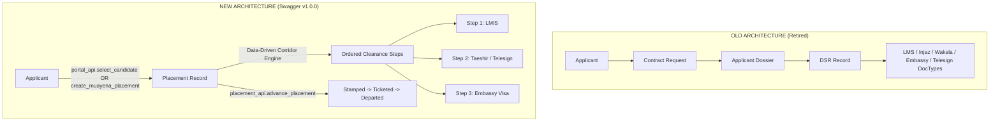
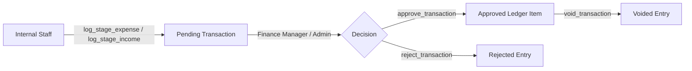

# BACKEND V2 MIGRATION AUDIT: FRONTEND vs. NEW AGENCY TRACKING BACKEND CONTRACT

**Document Version**: 2.0.0 (Read-Only Architectural Audit)  
**Target Specification**: `Agency Tracking API v1.0.0` (`swagger.json`)  
**Scope**: Complete Frontend (`src/`) Audit against New Whitelisted RPC Architecture (`agency_tracking.*`)  
**Author**: Antigravity Technical Migration Auditor  
**Date**: August 30, 2026  
**Status**: **COMPLETED & FACTUAL — ZERO SOURCE CODE MODIFICATIONS PERFORMED**

---

## EXECUTIVE SUMMARY & AUDIT STATUS

This audit evaluates the feasibility, breaking changes, schema gaps, architectural mismatches, and migration path required to transition the Travel Agency Frontend from its legacy Frappe implementation (`applicant_processing.*` + raw `/api/resource/*` DocType access) to the new `agency_tracking.*` whitelisted backend.

### Top Findings Summary:
1. **Elimination of Raw REST Access (`/api/resource/*`)**: The legacy frontend heavily uses direct CRUD on `Applicant`, `Applicant Dossier`, `DSR`, `Contract Request`, `Contractor`, `LMS Clearance`, `Injaz Clearance`, `Wakala Clearance`, `Embassy Clearance`, etc. The new backend enforces zero raw `/api/resource/*` access.
2. **Shift from `Dossier / DSR` to `Placement / Clearance Steps`**: In the old frontend, candidate progression is managed across `Applicant` → `Applicant Dossier` → `DSR` → separate stream DocTypes. The new backend replaces this with `Applicant` → `Placement` → `Clearance Steps`.
3. **Dynamic Corridor Engine**: The old frontend hardcodes Saudi vs. Kuwait multi-stream logic. The new backend introduces a data-driven corridor engine (`get_corridor_steps`).
4. **Enforced State Transition Enforcement**: Direct mutations of `applicant_state` are completely prohibited. All transitions must go through explicit whitelisted transition methods (`register_applicant`, `generate_cv`, `portal_api.select_candidate`, `placement_api.advance_placement`, `cancel_applicant`, `restart_applicant`).
5. **CSRF Enforcement**: The new backend requires `X-Frappe-CSRF-Token` on every state-changing POST request. The current frontend does not transmit this header.
6. **Critical Swagger Schema Gaps**: 100% of endpoints in `swagger.json` return generic `{ "message": { "type": "object" } }` without defined child properties. Furthermore, an authoritative **Applicant List** endpoint (`list_applicants`) is missing from the Swagger contract.

---

## 1. OLD VS. NEW BACKEND ARCHITECTURE COMPARISON

| Dimension | Old Backend Architecture | New Backend Architecture (`swagger.json`) | Architectural Impact |
| :--- | :--- | :--- | :--- |
| **API Surface Pattern** | Mixed REST (`/api/resource/*`) + RPC (`applicant_processing.*`) | **Strict Whitelist RPC Only** (`/api/method/agency_tracking.*`) | **RED**: Every direct resource fetch and mutation in frontend must be replaced. |
| **Authentication & Session** | Session Cookie via `frappe.auth.get_logged_user` & `get_my_agency_context` | Session Cookie via `/api/method/login` + `agency_tracking.auth_api.get_current_user` | **YELLOW**: Clean replacement; `get_current_user` allows Guest. |
| **CSRF Protection** | Unenforced / Absent in client fetch wrappers | **Mandatory** `X-Frappe-CSRF-Token` on all POST requests (`agency_tracking.auth_api.get_csrf_token`) | **RED**: Client fetch layer must inject CSRF header into all mutations. |
| **Candidate Relational Model** | `Applicant` ➔ `Applicant Dossier` ➔ `DSR` ➔ Sub-Clearance DocTypes | `Applicant` ➔ `Placement` ➔ `Clearance Step` (Generic Child Step Model) | **RED**: Complete structural refactor of operational data structures. |
| **Corridor Logic** | Hardcoded branching in TypeScript UI (`isSaudiApplicant` / `isKuwaitApplicant`) | Dynamic Corridor Engine (`agency_tracking.corridor_engine.get_corridor_steps`) | **YELLOW**: Move from hardcoded UI conditionals to backend-driven step lists. |
| **Clearance Processing** | 6+ discrete DocTypes (`LMS Clearance`, `Injaz Clearance`, etc.) queried in parallel | Single generic `Clearance Step` handled via `start`, `complete`, `reassign`, `submit/stamp/reject` | **YELLOW / GREEN**: Operational queues become drastically simpler. |
| **Lifecycle State Machine** | Client often sets `applicant_state` via `PUT /api/resource/Applicant` | Enforced Server State Machine; direct status updates throw 417 Validation Errors | **RED**: All manual state mutations must be removed from the frontend. |
| **Role / RBAC System** | 8 legacy roles (`System Manager`, `LMS Employee`, `Accounts Manager`, etc.) | **16 Granular Custom Roles** (`Saudi LMIS`, `Saudi Taeshir`, `Kuwait Telesign`, etc.) | **YELLOW**: Update role taxonomy and permission action maps in `permissions.ts`. |
| **Foreign Agency Catalog** | Filtered query on `Applicant` resource | Atomic row-locked `portal_api.list_portal_candidates` & `portal_api.select_candidate` | **YELLOW**: Replaces manual Dossier creation with atomic Placement creation. |
| **Financial Ledger** | Client created `Applicant Transaction` directly or via custom endpoint | Formal approval pipeline (`log_stage_expense`, `approve_transaction`, `create_commission_batch`, `settle_batch`) | **YELLOW**: Wire to structured financial workflows. |

---

## 2. COMPLETE OLD ➔ NEW API MIGRATION MAP

The table below inventories **every single API function** in `src/lib/api/applicantApi.ts` and `src/lib/api/auth.ts`:

| # | Frontend Function | Source File | What It Does | Old Endpoint | HTTP Method | New Equivalent Endpoint (`swagger.json`) | Mapping Status | Missing Info / Swagger Schema Gaps | Difficulty |
| :-: | :--- | :--- | :--- | :--- | :-: | :--- | :---: | :--- | :-: |
| 1 | `loginUser` | `auth.ts` | Authenticates user credentials | `/api/method/login` | POST | `/api/method/login` | **Exact** | None. Standard Frappe session auth. | Low |
| 2 | `logoutUser` | `auth.ts` | Destroys current session | `/api/method/logout` | POST | `/api/method/logout` | **Exact** | None. Standard Frappe logout. | Low |
| 3 | `getLoggedUser` | `auth.ts` | Checks current session username | `/api/method/frappe.auth.get_logged_user` | GET | `/api/method/agency_tracking.auth_api.get_current_user` | **Exact** | Response properties under `message` need confirmation. | Low |
| 4 | `fetchCurrentUserContext` | `auth.ts` | Loads user roles, full name, agency profile | `/api/method/applicant_processing.applicant_processing.api.get_my_agency_context` | GET | `/api/method/agency_tracking.auth_api.get_current_user` | **Exact** | Exact shape of roles array and contractor context. | Low |
| 5 | *(New Requirement)* `getCsrfToken` | `auth.ts` | Fetches mandatory CSRF token | *None (Missing in Frontend)* | — | `/api/method/agency_tracking.auth_api.get_csrf_token` | **New** | Must be called post-login and stored in memory. | Low |
| 6 | `createApplicantDraft` | `applicantApi.ts` | Opens draft candidate file | `/api/resource/Applicant` | POST | `/api/method/agency_tracking.applicant_api.create_applicant` | **Exact** | Expects `full_name`, `gender`, `nationality`, `entry_track`. Extra fields passed as form data. | Medium |
| 7 | `updateApplicantDraft` | `applicantApi.ts` | Updates draft/registered details | `/api/resource/Applicant/:id` | PUT | `/api/method/agency_tracking.applicant_api.update_applicant` | **Exact** | Parameter names in form data; ban override handling. | Medium |
| 8 | `getApplicant` | `applicantApi.ts` | Fetches single applicant record | `/api/resource/Applicant/:id` + child resources | GET | `/api/method/agency_tracking.applicant_api.get_applicant` | **Exact** | Response schema under `message` (child documents, active_placement). | Medium |
| 9 | `getApplicantsList` | `applicantApi.ts` | Fetches directory of all applicants | `/api/resource/Applicant?fields=[...]` | GET | **NONE IN SWAGGER** (`BACKEND GAP`) | **GAP** | **CRITICAL BLOCKER**: No `list_applicants` endpoint exists in Swagger. | High |
| 10 | `registerApplicant` | `applicantApi.ts` | Promotes Draft ➔ Registered | `/api/method/.../register_applicant` | POST | `/api/method/agency_tracking.applicant_api.register_applicant` | **Exact** | Takes `applicant_name`. Validation runs server-side. | Low |
| 11 | `updateApplicantForLmis` | `applicantApi.ts` | Sets national_id, labor_id, COC, emergency | *None (Mixed in update)* | — | `/api/method/agency_tracking.applicant_api.update_applicant_for_lmis` | **New** | New dedicated endpoint for LMIS-stage field capture. | Low |
| 12 | `generateCV` | `applicantApi.ts` | Renders official CV PDF & advances state | `/api/method/.../generate_cv` | POST | `/api/method/agency_tracking.cv_api.generate_cv` | **Exact** | Takes `applicant_name`. Advances to `CV Generated`. | Low |
| 13 | `getCVRecord` | `applicantApi.ts` | Fetches generated CV file details | `/api/resource/CV%20Record` | GET | *Included inside `get_applicant`* | **Partial** | Must confirm `cv_file_url` property in `get_applicant`. | Low |
| 14 | `cancelApplicant` | `applicantApi.ts` | Cancels candidate & active placement | `/api/method/.../cancel_applicant` | POST | `/api/method/agency_tracking.applicant_api.cancel_applicant` | **Exact** | Requires `applicant_name` and `reason`. | Low |
| 15 | `restoreApplicant` | `applicantApi.ts` | Restarts cancelled candidate | `/api/method/.../restore_applicant` | POST | `/api/method/agency_tracking.applicant_api.restart_applicant` | **Exact** | Requires `applicant_name` and `target_status` (`Draft` / `Registered`). | Low |
| 16 | `updateMusanedStatusApi` | `applicantApi.ts` | Updates Saudi Musaned reference | `/api/resource/Applicant/:id` (PUT) | PUT | `/api/method/agency_tracking.applicant_api.update_applicant` | **Partial** | Musaned fields are updated as extra form data on applicant update. | Medium |
| 17 | `getContractorsList` | `applicantApi.ts` | Lists foreign agencies / employers | `/api/resource/Contractor` | GET | **NONE IN SWAGGER** (`BACKEND GAP`) | **GAP** | Used by staff to assign agencies in Muayena track. | Medium |
| 18 | `createContractor` | `applicantApi.ts` | Creates foreign agency record | `/api/resource/Contractor` | POST | **NONE IN SWAGGER** (`BACKEND GAP`) | **GAP** | Agency creation is not documented in Swagger. | High |
| 19 | `sendContractRequestApi` | `applicantApi.ts` | Requests contract from agency | `/api/resource/Contract Request` | POST | `/api/method/agency_tracking.chat_api.create_agency_thread` / WhatsApp | **Replaced** | Replaced by communication thread or external portal flow. | High |
| 20 | `batchSendContractRequestsApi` | `applicantApi.ts` | Batch contract request dispatch | Custom RPC + Resource creation | POST | *None (Replaced by Portal Selection)* | **Replaced** | Agency selects candidate directly on portal. | High |
| 21 | `createApplicantDossier` | `applicantApi.ts` | Creates Dossier link record | `/api/resource/Applicant Dossier` | POST | `/api/method/agency_tracking.placement_api.create_muayena_placement` | **Exact (Muayena)** | For Muayena track. Standard track creates Placement on selection. | High |
| 22 | `approveDossierAndSelectApplicant` | `applicantApi.ts` | Approves contract & selects candidate | `/api/method/.../approve_dossier` | POST | `/api/method/agency_tracking.placement_api.upload_contract` | **Exact** | Attaches signed contract to Placement. | Medium |
| 23 | `parseDossierFileApi` | `applicantApi.ts` | OCR parses contract file | `/api/method/.../parse_dossier` | POST | `/api/method/agency_tracking.contract_parser.parse_contract_file` | **Exact** | Takes `file_url`, `destination_country`. | Low |
| 24 | `parsePassportMRZApi` | `applicantApi.ts` | Extracts MRZ from passport image | `/api/method/.../scan_and_populate` | POST | `/api/method/agency_tracking.passport_parser.parse_passport_file` | **Exact** | Takes `file_url`. | Low |
| 25 | `parseInjazFileApi` | `applicantApi.ts` | Extracts Saudi Injaz document fields | *None (Client OCR)* | — | `/api/method/agency_tracking.contract_parser.parse_injaz_file` | **New** | Takes `file_url`. | Low |
| 26 | `parseVisaFileApi` | `applicantApi.ts` | Extracts Kuwait eVisa document fields | *None (Client OCR)* | — | `/api/method/agency_tracking.contract_parser.parse_visa_file` | **New** | Takes `file_url`. | Low |
| 27 | `fetchProcessingData` | `applicantApi.ts` | Fetches 7 clearance sub-tables | Parallel `/api/resource/*` queries | GET | `/api/method/agency_tracking.placement_api.advance_placement` + `get_applicant` | **Replaced** | Replaced by querying linked `Clearance Step` child records. | High |
| 28 | `assignEmployeeApi` | `applicantApi.ts` | Assigns internal officer to clearance | Direct mutation on Clearance DocTypes | PUT | `/api/method/agency_tracking.clearance_api.reassign_clearance_step` | **Exact** | Takes `clearance_step_name`, `new_officer` (email). | Medium |
| 29 | `updateLmsClearanceApi` | `applicantApi.ts` | Advances LMIS stream | `/api/resource/LMS Clearance/:id` | PUT | `/api/method/agency_tracking.clearance_api.complete_clearance_step` | **Exact** | Completes to `Issued` for LMIS. | Medium |
| 30 | `updateWakalaClearanceApi` | `applicantApi.ts` | Updates Wakala authorization | `/api/resource/Wakala Clearance/:id` | PUT | `/api/method/agency_tracking.clearance_api.complete_clearance_step` | **Exact** | Completes to `Complete`. | Medium |
| 31 | `updateInjazClearanceApi` | `applicantApi.ts` | Updates Injaz platform fee/status | `/api/resource/Injaz Clearance/:id` | PUT | `/api/method/agency_tracking.clearance_api.complete_clearance_step` | **Exact** | Takes `reference_no`, `amount`. | Medium |
| 32 | `updateEmbassyClearanceApi` | `applicantApi.ts` | Updates Embassy submission/stamping | `/api/resource/Embassy Clearance/:id` | PUT | `submit_embassy_step` / `stamp_embassy_step` / `reject_embassy_step` | **Exact** | Explicit Monday submission / Thursday stamping endpoints. | Medium |
| 33 | `updateTelesignClearanceApi` | `applicantApi.ts` | Updates Kuwait Telesign clearance | `/api/resource/Telesign Clearance/:id` | PUT | `/api/method/agency_tracking.clearance_api.complete_clearance_step` | **Exact** | Completes to `Complete`. | Medium |
| 34 | `submitDsrStampApi` | `applicantApi.ts` | Marks candidate visa stamped | `/api/resource/DSR Stamp` | POST | `/api/method/agency_tracking.placement_api.advance_placement` | **Exact** | Advances Placement to `Stamped`. | Medium |
| 35 | `submitDsrTicketApi` | `applicantApi.ts` | Logs airline ticket & flight date | `/api/resource/DSR Ticket` | POST | `/api/method/agency_tracking.placement_api.record_ticket_details` | **Exact** | Takes `placement_name`, `ticket_number`, `flight_date`, `ticket_cost`. | Low |
| 36 | `recordRescheduleApi` | `applicantApi.ts` | Records flight reschedule | *None (Client calculation)* | — | `/api/method/agency_tracking.placement_api.record_reschedule` | **New** | Takes `placement_name`, `reschedule_date`, `reschedule_cause`, `reschedule_cost`. | Low |
| 37 | `submitDsrDepartureApi` | `applicantApi.ts` | Confirms worker departure at airport | `/api/resource/DSR Departure` | POST | `/api/method/agency_tracking.placement_api.advance_placement` | **Exact** | Advances Placement to `Departed`. | Low |
| 38 | `uploadFileApi` | `applicantApi.ts` | Multipart upload to server storage | `/api/method/upload_file` | POST | `/api/method/upload_file` | **Exact** | Returns `file_url`. | Low |
| 39 | `getAccountingSummaryApi` | `applicantApi.ts` | Aggregates income/expense metrics | `/api/method/.../get_accounting_summary` | GET | `get_cost_breakdown_report` + `get_employee_financial_report` | **Partial** | Summary metrics distributed across new report endpoints. | Medium |
| 40 | `recordAccountingTransactionApi` | `applicantApi.ts` | Logs expense/income transaction | `/api/resource/Applicant Transaction` | POST | `log_stage_expense` / `log_stage_income` | **Exact** | Dedicated endpoints for expense and income. | Low |
| 41 | `logApplicantFeeApi` | `applicantApi.ts` | Logs candidate registration fee | *None (Direct field write)* | — | `/api/method/agency_tracking.applicant_api.log_applicant_fee` | **New** | Sets `fee_status=Paid` and logs pending transaction. | Low |
| 42 | `approveTransactionApi` | `applicantApi.ts` | Finance manager approves entry | Direct update / Custom RPC | POST | `/api/method/agency_tracking.finance_api.approve_transaction` | **Exact** | Takes `transaction_name`. | Low |
| 43 | `rejectTransactionApi` | `applicantApi.ts` | Rejects pending transaction | Direct update / Custom RPC | POST | `/api/method/agency_tracking.finance_api.reject_transaction` | **Exact** | Requires `transaction_name`, `rejection_reason`. | Low |
| 44 | `voidTransactionApi` | `applicantApi.ts` | Voids approved transaction | Direct update / Custom RPC | POST | `/api/method/agency_tracking.finance_api.void_transaction` | **Exact** | Requires `transaction_name`, `void_reason`. | Low |
| 45 | `getFxRateApi` | `applicantApi.ts` | Queries current currency FX rate | *Hardcoded in frontend* | — | `/api/method/agency_tracking.finance_api.get_fx_rate` | **New** | Takes `currency`, optional `as_of_date`. | Low |
| 46 | `setFxRateApi` | `applicantApi.ts` | Manually sets currency FX rate | *None* | — | `/api/method/agency_tracking.finance_api.set_fx_rate` | **New** | Takes `currency`, `rate_to_birr`. | Low |
| 47 | `getOwedCommissionsApi` | `applicantApi.ts` | Queries unbatched commissions | Query on Applicant / Commission | GET | `/api/method/agency_tracking.finance_api.get_owed_commissions` | **Exact** | Requires `contractor`, `destination_country`. | Low |
| 48 | `createCommissionBatchApi` | `applicantApi.ts` | Batches commissions for settlement | *None (Manual)* | — | `/api/method/agency_tracking.finance_api.create_commission_batch` | **New** | Takes `contractor`, `destination_country`, optional `transaction_names`. | Low |
| 49 | `settleBatchApi` | `applicantApi.ts` | Settles commission batch | *None* | — | `/api/method/agency_tracking.finance_api.settle_batch` | **New** | Requires `batch_name`, `settlement_reference`. | Low |
| 50 | `triggerEarlyCommissionAccrualApi`| `applicantApi.ts`| Busses commission prior to departure | *None* | — | `/api/method/agency_tracking.finance_api.trigger_early_commission_accrual` | **New** | Takes `placement_name`. | Low |
| 51 | `exportCommissionsXlsxApi` | `applicantApi.ts` | Exports binary XLSX spreadsheet | `/api/method/.../export_commissions` | GET/POST| `/api/method/agency_tracking.report_api.export_commissions_xlsx` | **Exact** | Direct binary download stream. | Low |
| 52 | `uploadBankStatementApi` | `applicantApi.ts` | Uploads bank CSV for matching | *None* | — | `/api/method/agency_tracking.reconciliation_api.upload_bank_statement` | **New** | Takes `file_url`. | Low |
| 53 | `manuallyMatchLineApi` | `applicantApi.ts` | Matches statement line to batch | *None* | — | `/api/method/agency_tracking.reconciliation_api.manually_match_line` | **New** | Takes `statement_line_name`, `batch_name`. | Low |
| 54 | `getAgencyComplaintsApi` | `applicantApi.ts` | Queries agency complaints desk | `/api/resource/Agency Complaint` | GET | `/api/method/agency_tracking.complaint_api.list_unresolved_complaints` | **Partial** | Swagger only has unresolved list; tabbed/resolved lists require clarification. | Medium |
| 55 | `submitAgencyComplaintApi` | `applicantApi.ts` | Logs agency complaint | `/api/method/.../submit_agency_complaint` | POST | `/api/method/agency_tracking.complaint_api.create_complaint` | **Exact** | Requires `placement`, `description`, `worker_status_at_complaint`. | Low |
| 56 | `acknowledgeComplaintApi` | `applicantApi.ts` | Moves complaint New ➔ Unresolved | *None* | — | `/api/method/agency_tracking.complaint_api.acknowledge_complaint` | **New** | Requires `complaint_name`. | Low |
| 57 | `resolveAgencyComplaintApi` | `applicantApi.ts` | Resolves complaint with outcome | `/api/method/.../resolve_agency_complaint`| POST | `/api/method/agency_tracking.complaint_api.resolve_complaint` | **Exact** | Takes `complaint_name`, `new_status`, `resolution_notes`, `override_reason`. | Low |
| 58 | `getPortalAvailableCandidates` | `applicantApi.ts` | Browses marketplace candidate pool | Query on Applicant resource | GET | `/api/method/agency_tracking.portal_api.list_portal_candidates` | **Exact** | Atomic, country-scoped catalog. Non-PII fields. | Low |
| 59 | `portalSelectCandidateApi` | `applicantApi.ts` | Foreign agency locks & selects | Custom RPC + Contract Request | POST | `/api/method/agency_tracking.portal_api.select_candidate` | **Exact** | Row-locked atomic placement creation. Supports free replacement. | Low |
| 60 | `listMyWakalaRequestsApi` | `applicantApi.ts` | Lists agency's unpaid Wakala steps | *None* | — | `/api/method/agency_tracking.portal_api.list_my_wakala_requests` | **New** | Dedicated portal endpoint for Saudi agencies. | Low |
| 61 | `dispatchWakalaReminderApi` | `applicantApi.ts` | Triggers Wakala reminder | `/api/method/.../dispatch_wakala_reminder` | POST | `/api/method/agency_tracking.notification_api.trigger_wakala_reminder` | **Exact** | Takes `clearance_step_name`. | Low |
| 62 | `saveWebPushSubscriptionApi` | `applicantApi.ts` | Registers browser Web Push keys | `/api/method/.../save_web_push_subscription` | POST | `/api/method/agency_tracking.notification_api.subscribe_to_push` | **Exact** | Takes `endpoint`, `p256dh`, `auth`. | Low |
| 63 | `getPushSubscriptionStatusApi` | `applicantApi.ts` | Checks active push registration | *Local state* | — | `/api/method/agency_tracking.notification_api.get_push_subscription_status` | **New** | Verifies active subscription on server. | Low |
| 64 | `fetchOperationalWorkspaceData`| `applicantApi.ts`| Aggregates Excel-like workspace data | 9 parallel `/api/resource/*` queries | GET | `/api/method/agency_tracking.clearance_api.list_my_clearance_steps` | **Exact** | Replaces 9-way client join with single server queue endpoint. | Medium |
| 65 | `getCorridorStepsApi` | `applicantApi.ts` | Gets ordered corridor clearance steps | *None (Hardcoded in UI)* | — | `/api/method/agency_tracking.corridor_engine.get_corridor_steps` | **New** | Takes `destination_country`. | Low |
| 66 | `listMyClearanceStepsApi` | `applicantApi.ts` | Gets assigned clearance queue | *None (Hardcoded in UI)* | — | `/api/method/agency_tracking.clearance_api.list_my_clearance_steps` | **New** | Core data source for all operational workspaces. | Low |
| 67 | `recordSelectedMedicalResultApi`| `applicantApi.ts`| Records post-selection medical | Direct field update | PUT | `/api/method/agency_tracking.placement_api.record_selected_medical_result` | **New** | Takes `placement_name`, `status` (`FIT` / `UNFIT`), dates. UNFIT auto-cancels. | Low |
| 68 | `uploadVisaDocumentApi` | `applicantApi.ts` | Uploads Kuwait eVisa document | Direct field update | PUT | `/api/method/agency_tracking.placement_api.upload_visa` | **New** | Takes `placement_name`, `file_url`. | Low |
| 69 | `chatApi.listThreads` | `applicantApi.ts` | Lists user's chat threads | *None (Not in frontend)* | — | `/api/method/agency_tracking.chat_api.list_threads` | **New** | Chat subsystem. | Low |
| 70 | `chatApi.createAgencyThread` | `applicantApi.ts` | Opens agency ➔ communication thread | *None (Not in frontend)* | — | `/api/method/agency_tracking.chat_api.create_agency_thread` | **New** | Chat subsystem. | Low |
| 71 | `chatApi.createInternalThread` | `applicantApi.ts` | Opens staff-to-staff thread | *None (Not in frontend)* | — | `/api/method/agency_tracking.chat_api.create_internal_thread` | **New** | Chat subsystem. | Low |
| 72 | `chatApi.getThreadMessages` | `applicantApi.ts` | Loads thread chat history | *None (Not in frontend)* | — | `/api/method/agency_tracking.chat_api.get_thread_messages` | **New** | Chat subsystem. | Low |
| 73 | `chatApi.sendMessage` | `applicantApi.ts` | Posts chat message / attachment | *None (Not in frontend)* | — | `/api/method/agency_tracking.chat_api.send_message` | **New** | Chat subsystem. | Low |
| 74 | `chatApi.markRead` | `applicantApi.ts` | Clears unread chat counter | *None (Not in frontend)* | — | `/api/method/agency_tracking.chat_api.mark_read` | **New** | Chat subsystem. | Low |
| 75 | `chatApi.addParticipant` | `applicantApi.ts` | Adds staff user to internal thread | *None (Not in frontend)* | — | `/api/method/agency_tracking.chat_api.add_participant` | **New** | Chat subsystem. | Low |
| 76 | `getAvailableRolesApi` | `applicantApi.ts` | Lists assignable user roles | Direct Role Doctype fetch | GET | **NONE IN SWAGGER** (`BACKEND GAP`) | **GAP** | User Management settings page. | Medium |
| 77 | `getSystemUsersApi` | `applicantApi.ts` | Lists system staff users | `/api/resource/User` | GET | **NONE IN SWAGGER** (`BACKEND GAP`) | **GAP** | User Management settings page. | Medium |
| 78 | `createSystemUserApi` | `applicantApi.ts` | Creates new employee user | Custom RPC | POST | **NONE IN SWAGGER** (`BACKEND GAP`) | **GAP** | User Management settings page. | High |

---

## 3. APPLICANT LIFECYCLE AUDIT

### 3.1 State Transitions & Canonical Lifecycle
* **Old Frontend Assumption**: The frontend assumes stages: `Draft` ➔ `Registered` ➔ `CV Generated` ➔ `Request Pending` ➔ `Selected` ➔ `Processing` ➔ `Stamped` ➔ `Ticketed` ➔ `Departed` (and `Cancelled`).
* **New Backend Contract**: The `Applicant` DocType handles initial lifecycle:
  - `Draft`: Initial intake floor (`full_name`, `gender`, `nationality`, `entry_track`).
  - `Registered`: Promoted via `register_applicant`. Field floor and KYC validations run server-side.
  - `CV Generated`: Standard-track candidates only, via `agency_tracking.cv_api.generate_cv`.
  - `Cancelled`: Global escape hatch via `agency_tracking.applicant_api.cancel_applicant`.
  - `Restart`: Promoted back to `Draft` or `Registered` via `agency_tracking.applicant_api.restart_applicant` (increments `cycle_number`).
* **Placement Hand-Off**: Once a candidate is selected (`portal_api.select_candidate` or `placement_api.create_muayena_placement`), an `active_placement` is created. Progression from `Selected` ➔ `Processing` ➔ `Stamped` ➔ `Ticketed` ➔ `Departed` is governed on the **Placement record** (`placement_api.advance_placement`), not by directly modifying the Applicant document.

### 3.2 Registration & LMIS Edit Separation
* **Old Frontend**: Mixed `national_id`, `labor_id`, `coc_status`, and `exam_date` into initial registration form steps (Steps 2 & 3).
* **New Backend**: Explicitly specifies that `national_id`, `labor_id`, `emergency_contact_*`, `coc_status`, and `exam_date` are **deliberately NOT part of the initial Registered field floor**. They are captured during the LMIS clearance step via `agency_tracking.applicant_api.update_applicant_for_lmis`.

### 3.3 Country Bans & Overrides
* The new backend validates destination country changes against `Applicant Country Ban` records.
* An override can be executed only by `Manager` or `Admin` roles using `override_ban: true` and `override_reason: "..."` in `update_applicant`.

---

## 4. PLACEMENT & SELECTION AUDIT

### Paradigm Shift: `Dossier / DSR` ➔ `Placement / Clearance Steps`

### Key Differences:
1. **Agent Marketplace Selection**:
   - Old: Creates a `Contract Request` record; recruiter approves and creates `Applicant Dossier`.
   - New: `portal_api.select_candidate(applicant_name)` performs an **atomic, row-locked database operation** that creates the `Placement` immediately.
2. **Contract & Visa Uploads**:
   - Attached directly to the placement via `placement_api.upload_contract` (Saudi & Kuwait) and `placement_api.upload_visa` (Kuwait).
3. **Medical Gate**:
   - `placement_api.record_selected_medical_result`: Must be set to `FIT` before advancing to `Processing`. An `UNFIT` result immediately cancels the Placement and Applicant.

---

## 5. CORRIDOR & CLEARANCE WORKFLOW

### 5.1 Dynamic Corridor Engine (`get_corridor_steps`)
Instead of hardcoding country clearance paths in frontend React components:
- Frontend queries `agency_tracking.corridor_engine.get_corridor_steps(destination_country)`.
- Backend returns the ordered sequence of required steps for that corridor (e.g. Saudi Arabia vs. Kuwait).

### 5.2 Unified Clearance Step Execution
All non-Embassy clearance steps share uniform transition APIs:
- **`start_clearance_step(clearance_step_name)`**: Moves step from `Pending` ➔ `In Progress`.
- **`complete_clearance_step(clearance_step_name, reference_no, amount)`**:
  - For LMIS (both countries): Completes to `Issued`.
  - For Taeshir / Telesign / Others: Completes to `Complete`.

### 5.3 Specialized Embassy Workflow
Embassy visa processing follows a strict bilateral schedule:
- **Monday Submission**: `agency_tracking.clearance_api.submit_embassy_step` (`Pending` ➔ `Submitted`).
- **Thursday Stamping**: `agency_tracking.clearance_api.stamp_embassy_step` (`Submitted` ➔ `Stamped`).
- **Rejection Outcome**: `agency_tracking.clearance_api.reject_embassy_step` (Requires `rejection_remark`).

---

## 6. ROLE & RBAC MIGRATION

The new backend introduces **16 specialized custom roles**:

| Old Frontend Role (`permissions.ts`) | New Backend Custom Role (`swagger.json`) | Exact Match? | Required Migration Changes |
| :--- | :--- | :---: | :--- |
| `Recruiter` | `Registrar` | **Rename** | Update role token in frontend permissions and route guards. |
| `System Manager` / `Administrator` | `Admin` / `Manager` | **Exact** | Standard administrative access. |
| `Clearance Officer` | `Clearance Officer` | **Exact** | General clearance queue handler. |
| `LMS Employee` | `Saudi LMIS` / `Kuwait LMIS` | **Split** | Split into corridor-specific LMIS roles. |
| `Injaz Officer` | `Saudi Taeshir` | **Rename** | Renamed to Saudi Taeshir (handles Injaz fee/submission). |
| `Wakala Officer` | `Saudi Taeshir` / `Clearance Officer` | **Merged** | Wakala monitored via notifications & Taeshir step. |
| `Embassy Officer` | `Saudi Embassy` / `Kuwait Embassy` | **Split** | Split into corridor-specific embassy roles. |
| `Ticket Officer` / `Departure Officer` | `Ticketer` | **Merged** | Consolidated into single Ticketer role. |
| `Accounts Manager` / `Accounts Officer` | `Finance Manager` | **Consolidated**| Consolidated into Finance Manager role. |
| `Foreign Agency` | `Foreign Agency` | **Exact** | Partner agency catalog & selection. |
| *(None)* | `Complaint Manager` | **New Role** | Manages complaint intake, escalation, and resolution. |
| *(None)* | `Communication Manager` | **New Role** | Agency communications & chat threads. |
| *(None)* | `Contract Parser` | **New Role** | Contract & visa OCR validation. |
| *(None)* | `Kuwait Telesign` | **New Role** | Kuwait direct work permit verification. |

---

## 7. OPERATIONAL WORKSPACES & ASSIGNMENT MODEL

### 7.1 Operational Table & Drawer Architecture
The reusable [`OperationalTable.tsx`](file:///c:/Users/azwis/OneDrive/Desktop/Doc/Pro/Internship/Travel%20Agency%20Workflow/Travel%20Agency%20Frontend/travel_agency_workflow/src/components/operational/OperationalTable.tsx) and [`OperationalDrawer.tsx`](file:///c:/Users/azwis/OneDrive/Desktop/Doc/Pro/Internship/Travel%20Agency%20Workflow/Travel%20Agency%20Frontend/travel_agency_workflow/src/components/operational/OperationalDrawer.tsx) components are **architecturally well-aligned** with the new backend.
- Instead of performing a 9-way client join across legacy DocTypes, `fetchOperationalWorkspaceData` simply calls:
  `POST /api/method/agency_tracking.clearance_api.list_my_clearance_steps`
- The returned list maps directly to rows in the table.
- Drawer action buttons map directly to `start_clearance_step`, `complete_clearance_step`, `reassign_clearance_step`, `submit_embassy_step`, and `stamp_embassy_step`.

### 7.2 Assignment Model
- **Old Mechanism**: The frontend manually looked up `User` / `Employee` records and wrote the email/ID directly into `Clearance.employee` or `Applicant.locked_contractor`.
- **New Mechanism**: The backend uses auto-chained ToDo assignments. Reassignment is executed via:
  `agency_tracking.clearance_api.reassign_clearance_step(clearance_step_name, new_officer)` (Officer email).

---

## 8. FINANCE, COMMISSIONS & RECONCILIATION

### 8.1 Transaction Logging & Approval Flow

### 8.2 Commission Batching & Settlement
1. Unbatched commissions are retrieved via `agency_tracking.finance_api.get_owed_commissions(contractor, destination_country)`.
2. Finance Manager groups them into a settlement batch via `agency_tracking.finance_api.create_commission_batch`.
3. Payment confirmation is logged via `agency_tracking.finance_api.settle_batch(batch_name, settlement_reference)`.
4. Binary XLSX export is streamed via `agency_tracking.report_api.export_commissions_xlsx`.

### 8.3 Bank Reconciliation
- Bank statement CSV is uploaded via `agency_tracking.reconciliation_api.upload_bank_statement(file_url)`.
- Unmatched lines are manually linked via `agency_tracking.reconciliation_api.manually_match_line(statement_line_name, batch_name)`.

---

## 9. COMPLAINTS & WARRANTY MANAGEMENT

- **Intake**: Foreign agencies and staff log complaints via `agency_tracking.complaint_api.create_complaint(placement, description, worker_status_at_complaint)`.
- **Acknowledgement**: Complaint Manager acknowledges via `agency_tracking.complaint_api.acknowledge_complaint` (`New` ➔ `Unresolved`).
- **Resolution**: `agency_tracking.complaint_api.resolve_complaint`:
  - `Resolved`
  - `Returned - Free Replacement Required` (generates approved replacement credit)
  - `Escalated`
  - `Dismissed` (requires `resolution_notes`)
- **Free Replacement Application**: When partner agency selects a replacement candidate on the portal, they supply `free_replacement_for_complaint: "<COMPLAINT-ID>"` to `portal_api.select_candidate`.

---

## 10. CHAT, COMMUNICATION & NOTIFICATIONS

The new backend introduces a complete messaging and notifications system:
- **Agency Chat**: `create_agency_thread` (Foreign Agency ➔ Communication Manager 2-party fixed thread).
- **Internal Staff Chat**: `create_internal_thread`, `add_participant`, `send_message`, `get_thread_messages`, `list_threads`, `mark_read`.
- **Web Push Notifications**: `subscribe_to_push`, `get_push_subscription_status`.
- **Wakala Watchdog**: `trigger_wakala_reminder(clearance_step_name)`.

---

## 11. DOCUMENT PARSING & CV GENERATION

All parsing operations expect a `file_url` obtained from the standard `/api/method/upload_file` endpoint:
- **Passport MRZ OCR**: `agency_tracking.passport_parser.parse_passport_file` (ICAO 9303 parser with visual fallback).
- **Contract Parsing**: `agency_tracking.contract_parser.parse_contract_file(file_url, destination_country)`.
- **Saudi Injaz Parsing**: `agency_tracking.contract_parser.parse_injaz_file(file_url)`.
- **Kuwait eVisa Parsing**: `agency_tracking.contract_parser.parse_visa_file(file_url)`.
- **CV PDF Generation**: `agency_tracking.cv_api.generate_cv(applicant_name)`.

---

## 12. RESPONSE SCHEMA GAPS (CRITICAL SWAGGER AUDIT)

> [!CAUTION]
> The Swagger specification contains widespread schema omissions: every single endpoint defines its response as `{ "message": { "type": "object" } }` without specifying the nested keys, arrays, and types.

| Endpoint | Documented Response | Missing Properties / Fields Required by Frontend | Frontend Impact | Action Required by Backend Team |
| :--- | :---: | :--- | :--- | :--- |
| `applicant_api.get_applicant` | `{ "message": {} }` | `full_name`, `passport_number`, `entry_track`, `applicant_state`, `active_placement`, `clearance_steps` list, `medical_status`, `cv_file_url`, etc. | Cannot strongly type candidate detail page or KYC view. | Provide TypeScript interface / sample JSON for `get_applicant`. |
| `portal_api.list_portal_candidates` | `{ "message": {} }` | Array of candidate objects: `name`, `full_name`, `age`, `job_applied`, `photo_passport`, `cv_file_url`, `skills`, `experience_years`, etc. | Cannot strongly type Candidate Cards in the Agent Marketplace. | Provide field list returned in portal candidate array. |
| `clearance_api.list_my_clearance_steps` | `{ "message": {} }` | Array of step objects: `name`, `step_type`, `status`, `applicant_name`, `placement_name`, `assigned_officer`, `due_date`, etc. | Cannot strongly type Operational Workspace table rows. | Provide schema for Clearance Step queue item. |
| `corridor_engine.get_corridor_steps` | `{ "message": {} }` | Array of step definitions: `step_name`, `step_type`, `required_role`, `sequence`, `sla_days`, etc. | Cannot dynamically render corridor progression timeline. | Provide structure of corridor step definition object. |
| `chat_api.get_thread_messages` | `{ "message": {} }` | `message_id`, `sender`, `content`, `timestamp`, `attachment_url`, `mentioned_applicant`, `read_by` | Cannot build chat message bubbles and attachments. | Provide message entity schema. |
| `finance_api.get_owed_commissions` | `{ "message": {} }` | `transaction_name`, `applicant_name`, `contractor`, `amount`, `currency`, `departure_date` | Cannot populate commission settlement table. | Provide commission item object schema. |
| `report_api.get_cost_breakdown_report` | `{ "message": {} }` | Aggregated cost figures per corridor, period breakdown. | Cannot render Finance Report charts. | Provide report JSON schema. |

---

## 13. REQUEST SCHEMA & ERROR CONTRACT GAPS

1. **Request Schema Gaps**:
   - `create_applicant`: Form data schema defines only 4 base fields; exact allowlist of accepted auxiliary form fields needs documentation.
   - `update_applicant`: Form data fields are unlisted in Swagger parameters (only `applicant_name`, `override_ban`, `override_reason` are explicitly listed).
2. **Error Contract Gaps**:
   - **417 Validation Error**: Swagger states 417 is thrown for business rule violations, but does not document the response body format (`{ "exc_type": "...", "_server_messages": "..." }` vs `{ "message": "..." }`).
   - **403 Forbidden**: Thrown on permission check failure. Frontend must distinguish between unauthenticated (redirect to login) and unauthorized (display role permission banner).

---

## 14. FRONTEND FEATURES WITH NO NEW BACKEND EQUIVALENT

| Existing Frontend Feature | Current Implementation | New Swagger Equivalent | Status / Evaluation |
| :--- | :--- | :--- | :---: |
| **Applicant Directory Listing** | `GET /api/resource/Applicant?fields=[...]` | **NONE** | **RED (GAP)**: Need whitelisted `list_applicants` endpoint with pagination, search, and state filters. |
| **System User / Employee Management** | `GET/POST /api/resource/User` & `getSystemUsersApi` | **NONE** | **ORANGE (GAP)**: User administration endpoints not present in Swagger. |
| **Contractor / Agency Registration** | `POST /api/resource/Contractor` | **NONE** | **ORANGE (GAP)**: Staff creation of partner agencies missing. |
| **Contract Request Dispatch** | `POST /api/resource/Contract Request` | `portal_api.select_candidate` | **RESOLVED**: Replaced by Portal atomic selection flow. |
| **Manual State Recomputation** | `recalculate_applicant_state` RPC | Server auto-computed | **RESOLVED**: Transitions handle state computation automatically. |

---

## 15. NEW BACKEND FEATURES NOT YET EXPOSED IN FRONTEND

1. **Internal Staff & Agency Chat System** (`agency_tracking.chat_api.*`):
   - Multi-threaded messaging between staff and agencies with candidate record mentions and document attachments.
2. **Bank Statement Reconciliation** (`agency_tracking.reconciliation_api.*`):
   - CSV bank statement parser with automatic amount matching against commission settlement batches.
3. **Structured Commission Settlement Workflow** (`create_commission_batch`, `settle_batch`, `trigger_early_commission_accrual`):
   - Formal multi-stage commission lifecycle with batch IDs and audit references.
4. **Dynamic Corridor Definition Engine** (`get_corridor_steps`):
   - Backend-configurable deployment pathways without frontend code deployment.

---

## 16. EXACT FILE-LEVEL IMPACT

The table below lists every frontend file that will eventually be modified during the implementation phase:

| Category | File Path | Scope of Eventual Modification | Finding Classification |
| :--- | :--- | :--- | :---: |
| **API Layer** | `src/lib/api/auth.ts` | Replace context fetch with `get_current_user`; add CSRF token management. | **YELLOW** |
| **API Layer** | `src/lib/api/applicantApi.ts` | Complete rewrite: replace all `/api/resource/*` and old RPCs with `agency_tracking.*`. | **RED** |
| **Auth / RBAC** | `src/lib/auth/permissions.ts` | Update role taxonomy to the 16 new roles; adjust capability maps. | **YELLOW** |
| **Types** | `src/types/applicant.ts` | Refactor types: add `Placement`, `ClearanceStep`, `CommissionBatch`, `ChatThread`. | **YELLOW** |
| **Types** | `src/types/processing.ts` | Deprecate `ApplicantDossier` and `DSR`; replace with `ClearanceStep`. | **YELLOW** |
| **Workspaces** | `src/components/operational/OperationalTable.tsx` | Wire data loader directly to `list_my_clearance_steps`. | **GREEN** |
| **Workspaces** | `src/components/operational/OperationalDrawer.tsx` | Wire action buttons to `start`, `complete`, `reassign`, `submit/stamp` endpoints. | **GREEN** |
| **Workspaces** | `src/components/operational/workspaces/*.tsx` | Connect each workspace view to its respective corridor step queue. | **YELLOW** |
| **Applicant Flow**| `src/components/applicant/ApplicantRegistrationForm.tsx` | Update payload submission to `create_applicant` / `update_applicant`. | **YELLOW** |
| **Applicant Flow**| `src/app/applicants/[id]/page.tsx` | Switch processing view from 3-stream grid to `ClearanceStep` timeline. | **YELLOW** |
| **Applicant Flow**| `src/app/applicants/[id]/contractor-doc/page.tsx` | Replace Dossier CRUD with `placement_api.upload_contract`. | **YELLOW** |
| **Agent Portal** | `src/app/agent/page.tsx` & `CandidateCard.tsx` | Wire selection button to `portal_api.select_candidate`. | **GREEN** |
| **Finance** | `src/app/expenses-income/page.tsx` | Wire forms to `log_stage_expense`, `log_stage_income`, `approve_transaction`. | **YELLOW** |
| **Commissions** | `src/app/commission/page.tsx` & `src/app/agent/commission/page.tsx` | Wire to `get_owed_commissions`, `create_commission_batch`, `settle_batch`. | **YELLOW** |
| **Complaints** | `src/app/complaints/page.tsx` & `src/app/agent/complaints/page.tsx` | Wire to `list_unresolved_complaints`, `create_complaint`, `resolve_complaint`. | **YELLOW** |
| **Reports** | `src/app/reports/page.tsx` | Wire KPI metrics to new report endpoints (`get_cost_breakdown_report`, etc.). | **ORANGE** |

---

## 17. FINAL MIGRATION SCORECARD

| Assessment Area | Status Score | Summary Rationale |
| :--- | :---: | :--- |
| **A. API Compatibility** | **YELLOW** | Endpoints are clearly whitelisted and structured; 1 missing endpoint (`list_applicants`). |
| **B. Authentication Compatibility** | **YELLOW** | Standard Frappe login; requires adding CSRF token injection to fetch interceptor. |
| **C. RBAC Compatibility** | **GREEN** | Clear mapping from old 8 roles to 16 new granular custom roles. |
| **D. Applicant Lifecycle Compatibility** | **YELLOW** | Strict server-side state machine; requires removing frontend state mutations. |
| **E. Placement Compatibility** | **GREEN** | Clean transition from Dossier to Placement record model. |
| **F. Corridor Compatibility** | **GREEN** | Dynamic corridor engine simplifies frontend branching significantly. |
| **G. Clearance Compatibility** | **GREEN** | Standardized `Clearance Step` workflow aligns directly with `OperationalTable`. |
| **H. Finance Compatibility** | **GREEN** | Complete expense, income, FX, and commission batching pipeline provided. |
| **I. Reports Compatibility** | **ORANGE** | Financial reports covered; operational funnel/turnaround report endpoints are missing. |
| **J. Complaint Compatibility** | **GREEN** | Intake, acknowledge, resolve, and free replacement lifecycle fully supported. |
| **K. Chat / Notification Compatibility** | **GREEN** | Complete messaging and push notification endpoints defined. |
| **L. Document Parsing Compatibility** | **GREEN** | Clean `file_url`-based endpoints for passport, contract, Injaz, and visa parsing. |

---

## 18. BLOCKERS BEFORE IMPLEMENTATION

The following items are the **ONLY genuine blockers** that prevent safe, full-scale frontend migration:

### Blocker 1: Missing Authoritative Applicant Directory Listing API (`list_applicants`)
* **Why it matters**: The main Applicants Directory (`/applicants`) and search bar require an endpoint to list all candidates with pagination, status filters, and search queries. The new Swagger contains `get_applicant(applicant_name)` and `list_portal_candidates()`, but has **no general internal staff applicant listing endpoint**.
* **Swagger Evidence**: Search for `list_applicants` or `get_applicants` in `swagger.json` yields 0 results.
* **Required from Backend Team**: Whitelist and document `POST /api/method/agency_tracking.applicant_api.list_applicants` with parameters for `page`, `limit`, `status_filter`, `corridor_filter`, and `search_query`.
* **Workaround Potential**: High risk of breakage if we query raw `/api/resource/Applicant` since the new backend prohibits raw resource access.

### Blocker 2: Missing Response Object Schemas
* **Why it matters**: All Swagger response schemas specify `{ "message": { "type": "object" } }` with empty properties. Without knowing the exact JSON keys returned for `get_applicant`, `list_my_clearance_steps`, `list_portal_candidates`, and `get_corridor_steps`, TypeScript interfaces cannot be finalized.
* **Required from Backend Team**: Provide example JSON payloads or TypeScript definitions for the core response objects.

---

## 19. FINAL RECOMMENDATIONS & MIGRATION ROADMAP

### Explicit Answers to Guiding Questions:

1. **Can we safely start implementing against the new backend now?**  
   * **Yes, in phased parallel modules**, while requesting backend clarification on the 2 blockers above.
2. **Which parts can be implemented immediately?**  
   * Authentication & CSRF token interceptor layer.
   * Document Parsing integrations (`parse_passport_file`, `parse_contract_file`, `parse_visa_file`, `parse_injaz_file`).
   * Agent Portal marketplace & atomic candidate selection (`list_portal_candidates`, `select_candidate`).
   * Clearance queue operational workspaces (`list_my_clearance_steps`, `start_clearance_step`, `complete_clearance_step`, `submit_embassy_step`, `stamp_embassy_step`).
   * Financial transaction logging and approvals (`log_stage_expense`, `log_stage_income`, `approve_transaction`, `void_transaction`).
3. **Which parts must wait for backend clarification?**  
   * Main Applicants Directory table (pending `list_applicants` endpoint).
   * Settings User/Employee Management (pending user administration whitelist).
   * Operational KPI Analytics reports (pending funnel report endpoints).
4. **Which parts of the existing frontend can be reused unchanged?**  
   * UI components: `OperationalTable`, `OperationalDrawer`, `AppSidebar`, `AppNavbar`, `PushNotificationToggle`, `SimpleSelect`, modal dialogs, and design token styling.
5. **Which old frontend architecture should be retired?**  
   * Raw `/api/resource/*` client queries.
   * `Applicant Dossier` and `DSR` state managers.
   * Client-side lifecycle status mutations.
6. **What should the new frontend API layer look like?**  
   * A modular, type-safe API client organized by Swagger tags:
     - `src/lib/api/auth.ts` (`login`, `logout`, `getCurrentUser`, `getCsrfToken`)
     - `src/lib/api/applicant.ts` (`createApplicant`, `registerApplicant`, `getApplicant`, etc.)
     - `src/lib/api/clearance.ts` (`listMySteps`, `startStep`, `completeStep`, `embassySteps`)
     - `src/lib/api/portal.ts` (`listCandidates`, `selectCandidate`, `listWakalaRequests`)
     - `src/lib/api/finance.ts` (`logExpense`, `logIncome`, `commissions`, `fxRates`, `reconciliation`)
     - `src/lib/api/chat.ts` (`threads`, `messages`)
7. **What should be implemented first?**  
   * **Phase 1**: Fetch client with automatic session cookie + CSRF header injection.  
   * **Phase 2**: Role taxonomy and capability mapping in `permissions.ts`.  
   * **Phase 3**: Operational Workspace queue migration (`list_my_clearance_steps`).  
   * **Phase 4**: Agent Portal selection migration.  
   * **Phase 5**: Finance, Complaints, and Document Parsing.
8. **What should NOT be touched yet?**  
   * Do NOT rewrite the main `/applicants` directory page until the backend team supplies the `list_applicants` specification.
   * Do NOT delete legacy types until the new API modules are tested end-to-end.
