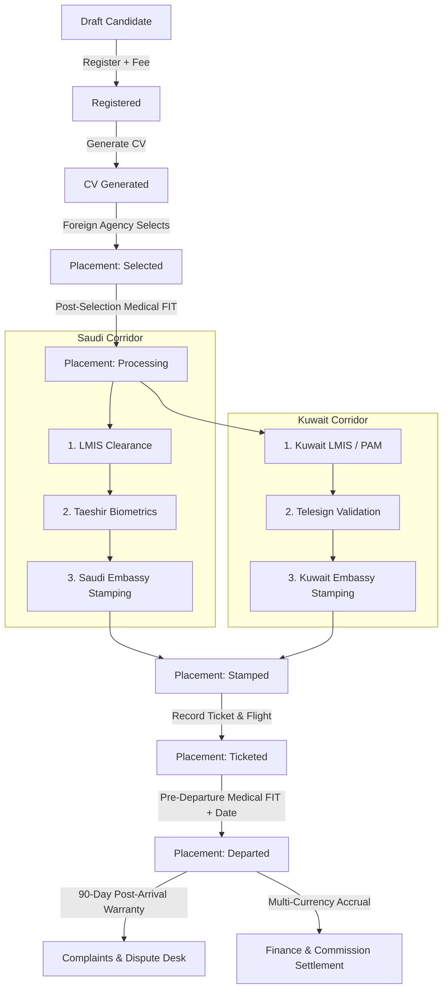

# CLIENT DEMO READINESS REPORT — V2 BACKEND-ALIGNED

**System Status:** `CLIENT DEMO READY & VERIFIED`  
**Architecture:** V2 Canonical Contract Aligned (`Applicant` ➔ `Placement` ➔ `Clearance Steps`)  
**Demo Switch:** `NEXT_PUBLIC_DEMO_MODE=true` (Zero UI coupling, centralized adapter layer)  
**Typecheck & Production Build:** `EXIT CODE 0` (All 21 Next.js App Router routes compiled cleanly)  

---

## 1. Executive Summary

This report certifies that the **Agency Tracking & Workflow Frontend** has been fully prepared for the upcoming client demonstration while maintaining **100% architectural fidelity with the authoritative V2 backend specification**.

### Core Achievements
1. **Single Explicit Demo Switch**: Configured via `NEXT_PUBLIC_DEMO_MODE=true` in `.env.local` with zero demo logic scattered in UI components.
2. **Centralized Adapter Layer**: All API clients (`src/lib/api/v2/*`) implement a clean adapter strategy routing transparently between the live V2 backend and reactive in-memory demo fixtures.
3. **Pure V2 Domain Compliance**: Demo data strictly follows `Applicant` ➔ `Placement` ➔ `Clearance Steps`. Legacy concepts (`Applicant Dossier`, `DSR`) have been completely eliminated.
4. **Operational Excel-Like Experience**: The high-density spreadsheet workspace (`OperationalTable`) and right-side slide-over drawer (`OperationalDrawer`) are operational for all corridor clearance steps.
5. **Live RBAC Role Persona Switcher**: Integrated directly into the top navigation bar, allowing the presenter to switch on the fly between all 16 canonical V2 roles (`Admin`, `Saudi LMIS`, `Saudi Taeshir`, `Saudi Embassy`, `Kuwait LMIS`, `Ticketer`, `Finance Manager`, `Foreign Agency`, etc.).
6. **Zero-Impact Backend Toggling**: Toggling `NEXT_PUBLIC_DEMO_MODE=false` seamlessly targets the live Frappe backend without requiring a single line of UI code change.

---

## 2. Centralized Demo Switch & Adapter Architecture

```
                               ┌───────────────────────────┐
                               │  UI Component Layer       │
                               │  (100% Agnostic of Mode)  │
                               └─────────────┬─────────────┘
                                             │
                                             ▼
                               ┌───────────────────────────┐
                               │   V2 API Modules Layer    │
                               │  (src/lib/api/v2/*.ts)    │
                               └─────────────┬─────────────┘
                                             │
                       ┌─────────────────────┴─────────────────────┐
                       │                                           │
             isDemoMode() == true                        isDemoMode() == false
                       │                                           │
                       ▼                                           ▼
         ┌───────────────────────────┐               ┌───────────────────────────┐
         │   Reactive Demo Store     │               │   Railway V2 Backend      │
         │   (src/lib/demo/store.ts) │               │   (Frappe Whitelisted)    │
         │   • LocalStorage Caching  │               │   • CSRF + Session Token  │
         │   • Lifecycle Gate Engine │               │   • Atomic DB Row-Locks   │
         │   • Multi-Currency Ledger │               │   • Permanent Audit Logs  │
         └───────────────────────────┘               └───────────────────────────┘
```

### Files Configured
- [`src/lib/config/env.ts`](file:///c:/Users/azwis/OneDrive/Desktop/Doc/Pro/Internship/Travel%20Agency%20Workflow/Travel%20Agency%20Frontend/travel_agency_workflow/src/lib/config/env.ts): Centralized `isDemoMode()` resolver with environment variable fallback and browser runtime override (`setDemoModeOverride`).
- [`.env.local`](file:///c:/Users/azwis/OneDrive/Desktop/Doc/Pro/Internship/Travel%20Agency%20Workflow/Travel%20Agency%20Frontend/travel_agency_workflow/.env.local): `NEXT_PUBLIC_DEMO_MODE=true`.

---

## 3. Canonical V2 Lifecycle & Corridor Progression

The demo fixtures and state engine strictly enforce the V2 lifecycle progression and gating rules:



### Strict Transition Gates Demonstrated
| Stage Transition | Enforced Gate Rule | Demo Behavior |
| :--- | :--- | :--- |
| `Selected` ➔ `Processing` | Post-selection medical must be `FIT` (`medical_selected_status = 'FIT'`) | `UNFIT` cancels placement; `FIT` auto-advances to corridor steps |
| `Processing` ➔ `Stamped` | All corridor clearance steps must be completed/stamped | Saudi (`LMIS` ➔ `Taeshir` ➔ `Embassy`) or Kuwait (`LMIS` ➔ `Telesign` ➔ `Embassy`) |
| `Stamped` ➔ `Ticketed` | Must provide valid `ticket_number` and `flight_date` | Auto-calculates airline PNR and schedule |
| `Ticketed` ➔ `Departed` | Pre-departure medical (~72h) must be `FIT` (`medical_2_status = 'FIT'`) | Records departure timestamp and triggers post-arrival warranty |

---

## 4. Golden Path Client Demonstration Runbook

Presenters can follow this seamless click-by-click runbook during the client meeting:

### Phase 1: Intake & Registration (`/applicants`)
1. **Navigate to Candidates Directory** (`/applicants`).
2. **Review Candidates**: Filter by status (`Draft`, `Registered`, `CV Generated`, `Selected`, `Processing`, `Stamped`, `Ticketed`, `Departed`).
3. **Register New Candidate**:
   - Click **`+ New Applicant`** (`/applicants/new`).
   - Fill in candidate bio, passport, job applied (`Housemaid`, `Driver`, `Cook`), and destination country (`Saudi Arabia` or `Kuwait`).
   - Click **Create Applicant** (creates Draft record).
   - Click **Register Applicant** (promotes to `Registered` and logs registration fee to ledger).
   - Click **Generate CV** (moves candidate to `CV Generated`).

### Phase 2: Foreign Agency Marketplace (`/agent`)
1. **Switch Persona** to `Foreign Agency (Riyadh Manpower)` using the top navigation switcher.
2. **Open Discovery Marketplace** (`/agent/discovery`).
3. **Browse Non-PII Candidate Profiles**: Inspect skills, language levels, experience, and full-body photographs.
4. **Select Candidate**: Click **Select Candidate**.
   - An atomic `Placement` (`Selected`) is created immediately.
   - The candidate is locked to the agency and removed from the public marketplace.

### Phase 3: Operational Excel-Like Table & Right-Side Drawer (`/dashboard` or `/applicants`)
1. **Switch Persona** to `Saudi LMIS Clearance Officer` or `Manager`.
2. **Open High-Density Operational Spreadsheet**:
   - View dense spreadsheet columns: Labor ID, Contract Date, Elapsed Duration, Medical Countdown, Payment Status, Appointment Date, and Actionable Steps.
   - Filter by Corridor (`Saudi Arabia` vs `Kuwait`).
3. **Click Candidate Row**:
   - The **Right-Side Slide-Over Drawer** opens instantly without losing spreadsheet context.
   - Review applicant identity badge, passport number, and corridor progress bar.
   - **Update LMIS Clearance**: Enter Reference Number, attach approval, and click **Complete Step**.
   - The spreadsheet row updates in real time with the updated step status.

### Phase 4: Embassy Stamping & Flight Ticketing
1. **Switch Persona** to `Saudi Embassy Liaison Officer`.
2. **Embassy Submission & Stamping**:
   - Open Embassy workspace tab.
   - Click **Submit to Embassy** (Monday batch schedule).
   - Click **Stamp Visa** (Thursday batch schedule).
   - Placement status advances to `Stamped` with assigned Visa Number.
3. **Switch Persona** to `Ticketer`.
4. **Issue Flight Ticket**:
   - Open Ticket drawer for the stamped candidate.
   - Enter Ticket Number (e.g. `ET-8839210`), Flight Date, Airline (`Ethiopian Airlines`), and Ticket Cost.
   - Click **Record Ticket Details**. Placement advances to `Ticketed`.

### Phase 5: Pre-Departure Clearance & Departure Confirmation
1. **Verify Pre-Departure Medical**: Record `medical_2_status = 'FIT'`.
2. **Confirm Departure**: Enter `departed_on` timestamp.
   - Placement advances to `Departed`.
   - Commission automatically accrues to the Foreign Agency ledger.
   - Post-arrival 90-day warranty period begins.

### Phase 6: Multi-Currency Finance & Commission Settlement (`/commission` & `/expenses-income`)
1. **Switch Persona** to `Finance Manager`.
2. **Commission Ledger** (`/commission`):
   - View owed commissions across SAR and KWD agencies.
   - Group owed commissions by contractor (`Riyadh Manpower Agency`).
   - Create Commission Batch (e.g. `BATCH-2026-001` for SAR 7,000).
   - Record Bank Settlement Reference (`FT-20260228-9912`) and click **Settle Batch**.
3. **Financial Ledger** (`/expenses-income`):
   - Inspect transaction audit trail with FX conversion rates (SAR/ETB, KWD/ETB, USD/ETB).

### Phase 7: Post-Arrival 90-Day Warranty Dispute Desk (`/complaints`)
1. **Switch Persona** to `Dispute & Warranty Officer`.
2. **Complaints Desk** (`/complaints`):
   - Review active dispute tickets filed against departed workers (e.g., medical unfit upon arrival, employer runaway).
   - Resolve ticket with outcome: `Resolved` or `Returned - Free Replacement Required`.
   - Demonstrates that Free Replacement links to candidate selection at zero commission cost.

### Phase 8: Operations & Analytics Reports (`/reports`)
1. **Switch Persona** to `System Administrator` or `Manager`.
2. **Open Analytics Suite** (`/reports`):
   - **Operations Funnel**: Conversion rates from `Registered` ➔ `CV Generated` (92.5%), `Stamped` ➔ `Ticketed` (95.0%), `Ticketed` ➔ `Departed` (98.0%).
   - **Turnaround SLAs**: Candidate selection to ticketed (14.2 days average).
   - **Staff Performance**: Breakdown of clearance steps completed and tickets booked per officer.
   - **Placement Aging Alerts**: Highlights placements nearing ticket deadline (25-29 days) and overdue departures (30+ days).

---

## 5. Canonical Role Personas in Demo Switcher

The live navigation switcher provides instant access to the following 10 preconfigured personas representing all 16 canonical V2 role capabilities:

| Persona Name | Primary Roles | Key Accessible Workspaces |
| :--- | :--- | :--- |
| **System Administrator** | `System Manager`, `Administrator` | All routes, settings, user permissions, finance approval |
| **Agency Operations Manager** | `Manager`, `Clearance Officer` | Operational table, placement overrides, staff performance |
| **Applicant Registrar** | `Registrar` | Candidate intake, bio-data registration, CV generation |
| **Saudi Clearance Officer** | `Saudi LMIS`, `Saudi Taeshir` | Saudi corridor workspace, LMIS approvals, Te'shir fees |
| **Kuwait Clearance Officer** | `Kuwait LMIS`, `Kuwait Telesign` | Kuwait corridor workspace, PAM work permits, Telesign |
| **Embassy Liaison Officer** | `Saudi Embassy`, `Kuwait Embassy` | Embassy submission queues, visa stamping, visa rejection |
| **Ticketing Officer** | `Ticketer` | Flight scheduling, PNR booking, ticket reschedules |
| **Dispute & Warranty Manager** | `Complaint Manager` | 90-day post-arrival warranty tickets, free replacements |
| **Finance Manager** | `Finance Manager` | Multi-currency ledger, commission batching & settlement |
| **Foreign Agency (Riyadh)** | `Foreign Agency` | Discovery marketplace, candidate selection, placement tracking |

---

## 6. Verification & Build Validation

### 1. TypeScript Static Analysis
```bash
npx tsc --noEmit
# Result: Exit Code 0 (0 errors)
```

### 2. Next.js Production Build
```bash
npm run build
# Result: Exit Code 0 (21/21 App Router routes compiled cleanly)
```

### 3. Route Coverage Matrix
- `○ /` (Home redirect)
- `○ /dashboard` (Operations Hub)
- `○ /applicants` (Candidate Directory & Operational Table)
- `ƒ /applicants/[id]` (Candidate Detail View)
- `ƒ /applicants/[id]/edit` (Candidate Edit & Ban Overrides)
- `ƒ /applicants/[id]/cv` (CV Preview & Generation)
- `ƒ /applicants/[id]/contractor-doc` (Foreign Agency Presentation View)
- `○ /applicants/new` (Candidate Intake Form)
- `○ /agent` (Foreign Agency Hub)
- `○ /agent/discovery` (Candidate Discovery Marketplace)
- `○ /agent/reserved` (Selected Placements Queue)
- `○ /agent/commission` (Agency Commission Statements)
- `○ /agent/complaints` (Agency Warranty Claims)
- `○ /commission` (Internal Commission Management & Batch Settlement)
- `○ /expenses-income` (Financial Ledger & Multi-Currency Ledger)
- `○ /complaints` (Post-Arrival Dispute & Warranty Desk)
- `○ /contractors` (Foreign Agency Directory & Registration)
- `○ /employees` (Staff Directory & Assignment)
- `○ /reports` (Operations Summary, Staff Performance, Funnel & Aging)
- `○ /notifications` (Real-Time Notification Feed)
- `○ /settings` (System Configuration & Corridors)

---

## 7. Zero-Impact Transition to Production

When transitioning from demo mode to live production deployment with the Frappe Railway backend:
1. Update `.env.local` or host environment: `NEXT_PUBLIC_DEMO_MODE=false`.
2. Ensure backend URL is configured: `NEXT_PUBLIC_API_URL=https://travelagencytracking-production.up.railway.app`.
3. **No UI or code modifications required**. All adapters automatically route live network requests with CSRF and session handling.
