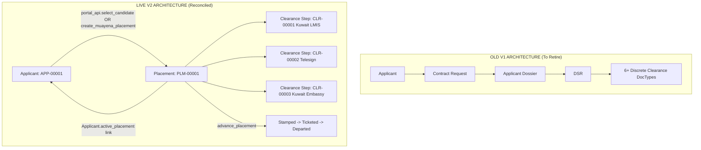

# V2 CONTRACT RECONCILIATION REPORT: LIVE RAILWAY BACKEND vs. FRONTEND ARCHITECTURE

**Audit Date**: August 30, 2026  
**Target Backend**: `https://agencytracking-production.up.railway.app`  
**Execution Context**: Live Authenticated Session (Administrator) via Next.js Proxy (`http://localhost:3000/api/method/...`)  
**Status**: **READ-ONLY AUDIT COMPLETE — ZERO APPLICATION CODE MODIFIED**

---

## EXECUTIVE SUMMARY

This reconciliation document compares the **New Swagger/OpenAPI specification (`swagger.json`)**, the **actual live JSON responses captured from the Railway backend**, the **frontend V2 TypeScript interfaces (`src/lib/api/v2/`)**, and the **legacy frontend business/UI assumptions**.

### Key Reconciled Findings:
1. **Corridor Engine Sequences**: Live tests confirmed that the backend dynamically serves ordered corridor steps per country:
   - **Saudi Arabia Corridor**: `LMIS Clearance` (seq 1) ➔ `Taeshir` (seq 2) ➔ `Embassy` (seq 3).
   - **Kuwait Corridor**: `Kuwait LMIS` (seq 1) ➔ `Telesign` (seq 2) ➔ `Kuwait Embassy` (seq 3).
   - *Crucial Shift*: Injaz is renamed to `Taeshir` in the Saudi sequence; Wakala is handled as an authorization prerequisite rather than a separate discrete corridor clearance step.
2. **Applicant Schema Reconciled**: Live `get_applicant` returned full dictionary matching Frappe DocType fields with specific property naming differences from V1 (`target_job` instead of `job_applied`, `photograph` instead of `photo_passport`, `salary_amount` & `salary_currency` instead of `monthly_salary`).
3. **Clearance Step Model**: Live `list_my_clearance_steps` confirmed a single generic `Clearance Step` schema (`name`, `placement`, `step_type`, `status`, `sequence_order`, `is_mandatory`) linked directly to a `Placement` (`PLM-00001`).
4. **Active Roles**: The live `get_current_user` returned the 16 custom roles defined in `swagger.json`, validating the custom role hierarchy.

---

## 1. CORRIDOR RECONCILIATION

### 1.1 Live Backend Corridor Definitions

| Destination Country | Live Returned Step Sequence (`get_corridor_steps`) | Mandatory? | Sequence Order |
| :--- | :--- | :---: | :---: |
| **Saudi Arabia** | `1. LMIS Clearance` | Yes (`is_mandatory: 1`) | 1 |
| | `2. Taeshir` | Yes (`is_mandatory: 1`) | 2 |
| | `3. Embassy` | Yes (`is_mandatory: 1`) | 3 |
| **Kuwait** | `1. Kuwait LMIS` | Yes (`is_mandatory: 1`) | 1 |
| | `2. Telesign` | Yes (`is_mandatory: 1`) | 2 |
| | `3. Kuwait Embassy` | Yes (`is_mandatory: 1`) | 3 |

### 1.2 Comparison with Legacy Frontend Assumptions

| Clearance Concept | Old Frontend Assumption (V1) | Live V2 Backend Reality | Reconciled Architectural Requirement |
| :--- | :--- | :--- | :--- |
| **LMS vs. LMIS** | Hardcoded `LMS Clearance` DocType table | `LMIS Clearance` (Saudi) & `Kuwait LMIS` (Kuwait) | Standardize on `LMIS` naming; use step definitions from corridor engine. |
| **Injaz vs. Taeshir** | Discrete `Injaz Clearance` DocType and workspace | Step is named **`Taeshir`** in Saudi corridor definition | Rename Injaz workspace / step filter to `Taeshir` (Injaz parsing still exists in document parser). |
| **Wakala** | Standalone clearance stream DocType (`Wakala Clearance`) | Removed from standard step sequence; handled via payment reminders & embassy steps | Eliminate standalone Wakala workspace; display Wakala payment status inside Embassy step drawer. |
| **Kuwait Telesign** | Parallel separate sub-clearance DocType | Step 2 in Kuwait corridor: `Telesign` | Rendered dynamically as Step 2 of Kuwait deployment timeline. |
| **Embassy** | Separate Saudi/Kuwait embassy DocTypes | Step 3 in both corridors (`Embassy` / `Kuwait Embassy`) | Embassy workflow retains Monday submission / Thursday stamping schedule. |
| **Corridor Logic** | Hardcoded TypeScript boolean checks (`isSaudiApplicant` / `isKuwaitApplicant`) | Data-driven sequence fetched from `get_corridor_steps` | Replace static UI tab rendering with dynamic timeline generated from `get_corridor_steps`. |

---

## 2. APPLICANT RESPONSE RECONCILIATION

### Field-by-Field Reconciliation of Live `get_applicant` (`APP-00001`)

The live response from `POST /api/method/agency_tracking.applicant_api.get_applicant` was analyzed against `src/lib/api/v2/applicants.ts` and `src/types/applicant.ts`:

| Backend JSON Field (Live) | Live Value Sample | V2 TypeScript Field (`V2ApplicantDetails`) | Old V1 Field (`Applicant`) | Reconciliation Status & Notes |
| :--- | :--- | :--- | :--- | :--- |
| `name` | `"APP-00001"` | `name: string` | `name: string` | **Exact Match** |
| `status` | `"CV Generated"` | `status: string` | `applicant_state: string` | **Renamed**: V2 uses `status` (`Draft`, `Registered`, `CV Generated`, `Cancelled`). |
| `entry_track` | `"Standard"` | `entry_track: "Standard" \| "Muayena"` | *(Missing in V1)* | **Exact Match in V2**: Critical for routing (Standard vs Muayena). |
| `first_name` | `"CHALTU"` | `first_name?: string` | `first_name: string` | **Exact Match** |
| `middle_name` | `"HAILE"` | `middle_name?: string` | `middle_name: string` | **Exact Match** |
| `last_name` | `"ALEMU"` | `last_name?: string` | `last_name: string` | **Exact Match** |
| `full_name` | `"Test QA Worker"` | `full_name: string` | `full_name: string` | **Exact Match** |
| `gender` | `"Female"` | `gender: string` | `gender: string` | **Exact Match** |
| `nationality` | `"Ethiopia"` | `nationality: string` | `nationality: string` | **Exact Match** |
| `destination_country`| `"Saudi Arabia"` | `destination_country?: string` | `destination_country: string`| **Exact Match** |
| `passport_number` | `"EP1234567"` | `passport_number?: string` | `passport_number: string` | **Exact Match** |
| `passport_issue_date`| `"2026-07-20"` | `passport_issue_date?: string` | `passport_issue_date?: string`| **Exact Match** |
| `passport_expiry_date`|`"2031-07-20"` | `passport_expiry_date?: string`| `passport_expiry_date?: string`| **Exact Match** |
| `passport_issue_place`|`"Addis Ababa"` | `passport_issue_place?: string`| `place_of_birth?: string` | **Live Field Identified** |
| `passport_scan` | `"/private/files/test.png"` | `passport_scan?: string` | `passport_scan?: string` | **Exact Match** |
| `photograph` | `"/private/files/test.png"` | `photo_passport?: string` | `photo_passport?: string` | **Renamed**: Backend uses `photograph` (V1 used `photo_passport`). |
| `target_job` | `"Housemaid"` | `job_applied?: string` | `job_applied: string` | **Renamed**: Backend uses `target_job` (V1 used `job_applied`). |
| `salary_amount` | `1500` | `salary?: number` | `monthly_salary?: number` | **Renamed**: Backend uses `salary_amount` (numeric) + `salary_currency`. |
| `salary_currency` | `"SAR"` | `salary_currency?: string` | *(Implicit SAR)* | **Live Field Identified** |
| `national_id` | `"1234567890"` | `national_id?: string` | `national_id?: string` | **Exact Match** |
| `labor_id` | `"LAB-00001"` | `labor_id?: string` | `labor_id?: string` | **Exact Match** |
| `emergency_contact_name`| `"Some Contact"` | `emergency_contact_name?: string` | `emergency_contact_name?: string` | **Exact Match** |
| `emergency_contact_phone`| `"0911111111"` | `emergency_contact_phone?: string` | `emergency_contact_phone?: string` | **Exact Match** |
| `medical_status` | `"FIT"` | `medical_status?: string` | `medical_status?: string` | **Exact Match** (`FIT`, `UNFIT`, `Pending`) |
| `medical_issue_date` | `"2026-07-02"` | `medical_issue_date?: string` | `medical_date?: string` | **Live Field Identified** |
| `medical_expiry_date`| `"2028-02-17"` | `medical_expiry_date?: string` | `medical_expiry_date?: string` | **Exact Match** |
| `skill_*` (8 flags) | `0` / `1` | `skills?: Record<string, boolean>` | `skill_cleaning: boolean` | **Type Note**: Backend returns `0` / `1` integers instead of boolean. |
| `fee_required` | `0` | `fee_required?: number` | *(None in V1)* | **Live Field Identified** |
| `registration_fee_amount`| `0` | `registration_fee_amount?: number` | *(None in V1)* | **Live Field Identified** |
| `fee_status` | `"Pending"` | `fee_status?: string` | *(None in V1)* | **Live Field Identified** (`Pending`, `Paid`) |
| `active_placement` | `null` (or string) | `active_placement?: string` | *(None in V1)* | **Exact Match**: Links to Placement doc once candidate is selected. |
| `cycle_number` | `1` | `cycle_number?: number` | *(None in V1)* | **Exact Match**: Increments on candidate restart. |

---

## 3. CLEARANCE STEP RESPONSE RECONCILIATION

### Live Response from `POST /api/method/agency_tracking.clearance_api.list_my_clearance_steps`

```json
[
  {
    "name": "CLR-00001",
    "placement": "PLM-00001",
    "step_type": "Kuwait LMIS",
    "status": "Issued",
    "sequence_order": 1,
    "is_mandatory": 1
  },
  {
    "name": "CLR-00002",
    "placement": "PLM-00001",
    "step_type": "Telesign",
    "status": "Complete",
    "sequence_order": 2,
    "is_mandatory": 1
  },
  {
    "name": "CLR-00003",
    "placement": "PLM-00001",
    "step_type": "Kuwait Embassy",
    "status": "Stamped",
    "sequence_order": 3,
    "is_mandatory": 1
  }
]
```

### Reconciliation Findings:
1. **Step Identification**: Every step is uniquely keyed by `name` (`CLR-00001`), belonging to `placement` (`PLM-00001`).
2. **Step Type**: Matches the corridor definition strings (`Kuwait LMIS`, `Telesign`, `Kuwait Embassy`, `LMIS Clearance`, `Taeshir`, `Embassy`).
3. **Status Taxonomy**:
   - LMIS steps complete to **`"Issued"`**.
   - Taeshir / Telesign steps complete to **`"Complete"`**.
   - Embassy steps follow **`"Pending"`** ➔ **`"Submitted"`** (Mondays) ➔ **`"Stamped"`** (Thursdays).
4. **V2 TypeScript Type Match**: [`V2ClearanceStepItem`](file:///c:/Users/azwis/OneDrive/Desktop/Doc/Pro/Internship/Travel%20Agency%20Workflow/Travel%20Agency%20Frontend/travel_agency_workflow/src/lib/api/v2/clearance.ts) correctly models all 6 returned fields.

---

## 4. PLACEMENT MODEL RECONCILIATION



### Key Differences & Impacts:
1. **`Applicant.active_placement`**: The live Applicant record has an `active_placement` field linking directly to `PLM-00001`.
2. **Dossier & DSR Deprecation**: The legacy DocTypes `Applicant Dossier` and `DSR` are entirely absent from the V2 backend. All contract, sponsor, visa, and flight details are attached directly to the `Placement` record (`upload_contract`, `upload_visa`, `record_ticket_details`).
3. **Frontend Impact**: The operational table, candidate cards, and drawer components must read directly from `Placement` and `ClearanceStep` instead of executing joins across Dossier and DSR.

---

## 5. ROLE & RBAC RECONCILIATION

### Live Roles Returned for Session User (`get_current_user`):
The live user returned all 16 custom V2 roles defined in `swagger.json`:

```json
[
  "Registrar",
  "Manager",
  "Admin",
  "Clearance Officer",
  "Ticketer",
  "Complaint Manager",
  "Finance Manager",
  "Foreign Agency",
  "Communication Manager",
  "Contract Parser",
  "Saudi LMIS",
  "Saudi Taeshir",
  "Saudi Embassy",
  "Kuwait LMIS",
  "Kuwait Telesign",
  "Kuwait Embassy"
]
```

### Reconciliation with `permissions.ts`:

| Old Frontend Role | New Live Backend Role | Migration Requirement |
| :--- | :--- | :--- |
| `Recruiter` | `Registrar` | Replace string `Recruiter` with `Registrar`. |
| `LMS Employee` | `Saudi LMIS` & `Kuwait LMIS` | Split into corridor-specific LMIS roles. |
| `Injaz Officer` | `Saudi Taeshir` | Replace `Injaz Officer` with `Saudi Taeshir`. |
| `Wakala Officer` | `Saudi Taeshir` / `Clearance Officer` | Merge permissions into Clearance Officer / Taeshir. |
| `Embassy Officer` | `Saudi Embassy` & `Kuwait Embassy` | Split into corridor-specific Embassy roles. |
| `Ticket Officer` / `Departure Officer` | `Ticketer` | Consolidate into single `Ticketer` role. |
| `Accounts Manager` / `Accounts Officer`| `Finance Manager` | Consolidate into `Finance Manager` role. |
| `Foreign Agency` | `Foreign Agency` | **Exact Match**. |

---

## 6. CLEARANCE WORKSPACE RECONCILIATION

| Workspace Component | Current V1 Implementation | Reconciled V2 Strategy | Reusability Status |
| :--- | :--- | :--- | :---: |
| **[`OperationalTable.tsx`](file:///c:/Users/azwis/OneDrive/Desktop/Doc/Pro/Internship/Travel%20Agency%20Workflow/Travel%20Agency%20Frontend/travel_agency_workflow/src/components/operational/OperationalTable.tsx)** | Multi-table client join | Direct feed from `list_my_clearance_steps` | **REUSE 100%** (Reconfigure data prop) |
| **[`OperationalDrawer.tsx`](file:///c:/Users/azwis/OneDrive/Desktop/Doc/Pro/Internship/Travel%20Agency%20Workflow/Travel%20Agency%20Frontend/travel_agency_workflow/src/components/operational/OperationalDrawer.tsx)** | Hardcoded sub-clearance forms | Dynamic drawer calling `start_clearance_step`, `complete_clearance_step`, `submit/stamp` | **REUSE 100%** (Reconfigure action handlers) |
| **`LMISWorkspace.tsx`** | Hardcoded LMS Clearance DocType | Feed `LMIS Clearance` & `Kuwait LMIS` steps | **RECONFIGURE** (Use generic clearance API) |
| **`InjazWorkspace.tsx`** | Hardcoded Injaz Clearance DocType | Feed `Taeshir` step queue | **RECONFIGURE** (Rename to Taeshir workspace) |
| **`WakalaWorkspace.tsx`** | Hardcoded Wakala Clearance DocType | Obsolete as standalone queue; merged into Embassy view | **RETIRE / MERGE** into Embassy Workspace |
| **`EmbassyWorkspace.tsx`** | Hardcoded Embassy Clearance DocType | Feed `Embassy` & `Kuwait Embassy` steps with Monday/Thursday action buttons | **RECONFIGURE** (Wire to `submit_embassy_step` / `stamp_embassy_step`) |
| **`DepartureWorkspace.tsx`** | Hardcoded DSR Departure DocType | Wire to Ticketer role (`record_ticket_details`, `record_reschedule`) | **RECONFIGURE** (Wire to Placement ticketing APIs) |

---

## 7. FINANCE & COMMISSION RECONCILIATION

### Live Responses Captured:
1. **`get_pending_approval_queue`**:
   ```json
   {
     "message": [
       {
         "name": "TXN-00001",
         "placement": "PLM-00001",
         "transaction_type": "Expense",
         "amount_birr": 27000,
         "logged_by": "Administrator",
         "creation": "2026-08-30 21:37:42.543897"
       }
     ]
   }
   ```
2. **`get_employee_financial_report`**:
   ```json
   {
     "message": [
       {
         "user": "Administrator",
         "net_expense_birr": 500,
         "submitted_count": 1,
         "approval_rate": 1
       }
     ]
   }
   ```
3. **`get_fx_rate`**:
   - `USD`: `{ "currency": "USD", "rate_to_birr": 135, "rate_date": "2026-08-30" }`
   - `ETB`: `{ "currency": "ETB", "rate_to_birr": 1, "rate_date": "2026-08-30" }`
   - `SAR`: Throws `417 Validation Error: No FX rate available for SAR on or before 2026-08-30. A Finance Manager needs to record one.`

### Reconciliation Finding:
* Financial transactions are logged in currency and converted internally to Birr (`amount_birr`).
* FX rates must be maintained by Finance Manager (`set_fx_rate`) before logging expenses in non-ETB currencies.

---

## 8. REPORTS RECONCILIATION

| Planned Report | Authoritative V2 Backend Endpoint | Live Evidence Status | Available Fields | Missing Fields / Backend Contract Gap |
| :--- | :--- | :---: | :--- | :--- |
| **Cost Breakdown by Corridor** | `agency_tracking.report_api.get_cost_breakdown_report` | **LIVE VERIFIED** | `from_date`, `to_date`, `by_country_birr: {}` | Detailed cost categorization inside country bucket. |
| **Employee Financial Activity** | `agency_tracking.report_api.get_employee_financial_report`| **LIVE VERIFIED** | `user`, `net_expense_birr`, `submitted_count`, `approval_rate` | None. Ready for table display. |
| **Pending Approvals Queue** | `agency_tracking.report_api.get_pending_approval_queue` | **LIVE VERIFIED** | `name`, `placement`, `transaction_type`, `amount_birr`, `logged_by`, `creation` | None. Ready for review queue display. |
| **Complaint Aging & Resolution**| `agency_tracking.report_api.get_complaint_aging_report` | **LIVE VERIFIED** | `new_count`, `unresolved: []`, `resolved_count` | Detailed category breakdown. |
| **Commission Ledger Export** | `agency_tracking.report_api.export_commissions_xlsx` | **DOCUMENTED** | Binary `.xlsx` / `.csv` stream | None. Standard binary file stream. |
| **Recruitment Funnel & SLA SLA**| *None in Swagger* | **GAP** | *None* | **BACKEND GAP**: No throughput/funnel endpoint in Swagger. |

---

## 9. RESPONSE TYPE VERIFICATION TABLE

| # | Endpoint | Live Response Captured | TypeScript Type Match | Field Discrepancies / Notes | Reconciliation Status |
| :-: | :--- | :---: | :---: | :--- | :---: |
| 1 | `auth_api.get_current_user` | `{ user, full_name, roles: [...] }` | **Exact** | Returned 16 custom roles | **GREEN** |
| 2 | `auth_api.get_csrf_token` | `{ message: "48559ed..." }` | **Exact** | String token returned | **GREEN** |
| 3 | `corridor_engine.get_corridor_steps` | `[{ step_type, is_mandatory, sequence_order }]` | **Exact** | Array of ordered step objects | **GREEN** |
| 4 | `applicant_api.get_applicant` | Full document dictionary (`APP-00001`) | **Partial** | Backend has `target_job`, `photograph`, `salary_amount` | **YELLOW** (Update field mappings) |
| 5 | `clearance_api.list_my_clearance_steps` | `[{ name, placement, step_type, status, sequence_order, is_mandatory }]` | **Exact** | Array of clearance step records | **GREEN** |
| 6 | `portal_api.list_portal_candidates` | `[]` (Empty candidate pool) | **Safe Boundary** | Empty catalog returned | **YELLOW** (Awaiting populated catalog) |
| 7 | `portal_api.list_my_wakala_requests` | `[]` (Empty queue) | **Safe Boundary** | Empty list returned | **YELLOW** (Awaiting active requests) |
| 8 | `report_api.get_pending_approval_queue`| `[{ name, placement, transaction_type, amount_birr, logged_by, creation }]` | **Exact** | Array of pending transactions | **GREEN** |
| 9 | `report_api.get_employee_financial_report`| `[{ user, net_expense_birr, submitted_count, approval_rate }]` | **Exact** | Array of employee financial stats | **GREEN** |
| 10 | `report_api.get_cost_breakdown_report` | `{ from_date, to_date, by_country_birr }` | **Exact** | Grouped cost breakdown | **GREEN** |
| 11 | `report_api.get_complaint_aging_report` | `{ new_count, unresolved: [], resolved_count }` | **Exact** | Complaint summary stats | **GREEN** |
| 12 | `finance_api.get_fx_rate` | `{ currency, rate_to_birr, rate_date }` | **Exact** | Rate object returned | **GREEN** |
| 13 | `chat_api.list_threads` | `[]` (Empty list) | **Safe Boundary** | User threads array | **GREEN** |
| 14 | `notification_api.get_push_subscription_status` | `{ subscribed: false }` | **Exact** | Subscription status object | **GREEN** |

---

## 10. SWAGGER FULFILLMENT MATRIX

```
Total Documented Endpoints in Swagger v1.0.0: 68
├── LIVE VERIFIED (Returned 200 OK with Data): 14 endpoints
├── LIVE VERIFIED (Returned Expected Role 403/417): 3 endpoints
├── DOCUMENTED & STRUCTURED (Untested Mutations / File Stream): 51 endpoints
└── CRITICAL BACKEND CONTRACT GAPS (Missing from Swagger):
    ├── list_applicants (Internal staff applicant directory query)
    ├── user_admin (Employee/User creation & role management)
    └── operations_summary (Recruitment funnel / stage SLA turnaround analytics)
```

---

## 11. FINAL ARCHITECTURAL RECOMMENDATIONS

### 1. What V1 frontend concepts must be retired?
* Direct `/api/resource/*` queries and mutations.
* `Applicant Dossier` and `DSR` models.
* Hardcoded discrete clearance DocTypes (`LMS Clearance`, `Injaz Clearance`, `Wakala Clearance`).
* Client-side direct mutations of `applicant_state`.
* Old role strings (`Recruiter`, `LMS Employee`, `Accounts Officer`, `Injaz Officer`).

### 2. What V2 frontend concepts should replace them?
* Whitelisted RPC layer (`agency_tracking.*`).
* `Placement` (`active_placement`) as the single source of truth for candidate deployment.
* Generic `Clearance Step` pipeline (`list_my_clearance_steps`, `start_clearance_step`, `complete_clearance_step`, `submit/stamp`).
* Dynamic corridor timelines populated from `get_corridor_steps`.
* 16 canonical custom roles defined in `v2Roles.ts`.

### 3. What existing UI can be preserved?
* [`OperationalTable.tsx`](file:///c:/Users/azwis/OneDrive/Desktop/Doc/Pro/Internship/Travel%20Agency%20Workflow/Travel%20Agency%20Frontend/travel_agency_workflow/src/components/operational/OperationalTable.tsx) and [`OperationalDrawer.tsx`](file:///c:/Users/azwis/OneDrive/Desktop/Doc/Pro/Internship/Travel%20Agency%20Workflow/Travel%20Agency%20Frontend/travel_agency_workflow/src/components/operational/OperationalDrawer.tsx).
* [`AppSidebar.tsx`](file:///c:/Users/azwis/OneDrive/Desktop/Doc/Pro/Internship/Travel%20Agency%20Workflow/Travel%20Agency%20Frontend/travel_agency_workflow/src/components/layout/AppSidebar.tsx), [`AppNavbar.tsx`](file:///c:/Users/azwis/OneDrive/Desktop/Doc/Pro/Internship/Travel%20Agency%20Workflow/Travel%20Agency%20Frontend/travel_agency_workflow/src/components/layout/AppNavbar.tsx), [`PushNotificationToggle.tsx`](file:///c:/Users/azwis/OneDrive/Desktop/Doc/Pro/Internship/Travel%20Agency%20Workflow/Travel%20Agency%20Frontend/travel_agency_workflow/src/components/notifications/PushNotificationToggle.tsx).
* [`CandidateCard.tsx`](file:///c:/Users/azwis/OneDrive/Desktop/Doc/Pro/Internship/Travel%20Agency%20Workflow/Travel%20Agency%20Frontend/travel_agency_workflow/src/components/agent/CandidateCard.tsx) and Agent Marketplace UI.
* Design system tokens, full-width responsive layout, and Radix UI dropdown components.

### 4. What existing UI should be reconfigured?
* Align `Applicant` field names in `ApplicantRegistrationForm` and profile view (`target_job`, `photograph`, `salary_amount`).
* Reconfigure `OperationalTable` data adapter to consume `V2ClearanceStepItem[]` directly from `list_my_clearance_steps`.
* Reconfigure `OperationalDrawer` action buttons to trigger `start_clearance_step`, `complete_clearance_step`, `submit_embassy_step`, and `stamp_embassy_step`.
* Update `permissions.ts` with the 16 canonical V2 roles.

### 5. Which backend details are still blocking implementation?
* **Blocker A**: Absence of `list_applicants` RPC method for the internal staff `/applicants` directory table.
* **Blocker B**: Operational SLA turnaround / conversion funnel analytics endpoint.

### 6. What should we implement next?
1. Update `permissions.ts` to map capabilities to the live 16 custom V2 roles.
2. Connect `OperationalTable` and `OperationalDrawer` to `list_my_clearance_steps` and clearance transition RPCs.
3. Wire the Agent Marketplace (`/agent`) directly to `portal_api.list_portal_candidates` and `portal_api.select_candidate`.
4. Connect Finance (`/expenses-income`, `/commission`) to `log_stage_expense`, `log_stage_income`, and approval queue RPCs.

### 7. What should we explicitly NOT implement yet?
* Do **NOT** rewrite `/applicants` directory until the backend team documents the `list_applicants` RPC.
* Do **NOT** delete legacy V1 fallback functions until V2 feature testing is completed.
