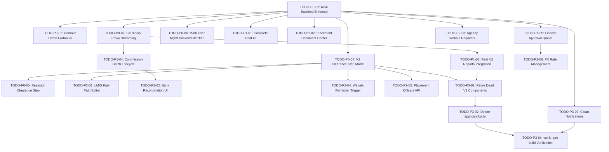

# V2 FRONTEND IMPLEMENTATION & REPAIR TODO PLAN

**Target Branch**: `production_version_non_mock`  
**Backend Authority**: `https://travelagency-production-b48d.up.railway.app`  
**Audit Baseline**: `FINAL_V2_CONFORMANCE_MATRIX.md`  
**Status Policy**: Real Backend Only • No Demo Mode • No Mock Business Data • No V1 Fallbacks  

---

## 1. Priority Architecture & Execution Order

All tasks are strictly prioritized according to system impact:
- **P0 (Blocking Core System)**: Configuration enforcement (real backend only), proxy binary handling, removing silent demo fallbacks, transitioning operational clearance workspaces to V2 Clearance Step model, and retiring broken V1 assignment RPCs.
- **P1 (Required Product Capability)**: Building the dedicated Chat workspace, modernizing placement contract/visa uploads, replacing legacy report views with real backend report APIs, completing commission batch lifecycle UI, and adding finance transaction approvals.
- **P2 (Important Secondary Capability)**: LMIS fast-path editor, bank statement reconciliation, foreign agency wakala requests dashboard, wakala payment reminder trigger, placement officers introspection, and FX rate management.
- **P3 (Non-Critical / Admin Polish)**: Retiring dead V1 components, full deletion of `applicantApi.ts`, cleaning `localStorage` business persistence in notifications, and full build/typecheck verification.

---

## 2. Master Itemized Repair Plan

| ID | Feature | Problem | Current Behavior | Expected V2 Behavior | Exact Backend Endpoint | Priority | Dependencies | Files Likely Affected | Status |
|---|---|---|---|---|---|---|---|---|---|
| **TODO-P0-01** | Production Real Backend Enforcement | `.env.local` has `NEXT_PUBLIC_DEMO_MODE=true` and `isDemoMode()` uses localStorage override, causing UI to read simulated data. | Returns dummy records from `demoStore`. | Strictly query live Railway backend (`NEXT_PUBLIC_DEMO_MODE=false`). Purge runtime demo toggle. | All endpoints | **P0** | None | `.env.local`, `src/lib/config/env.ts`, `src/components/providers/AuthProvider.tsx` | **VERIFIED** |
| **TODO-P0-02** | Proxy Binary Stream Corruptions | Next.js method proxy (`route.ts`) parses `res.json()` on all responses, mangling binary Excel and PDF exports into error strings. | Calling `export_commissions_xlsx` or `get_batch_invoice_pdf` returns JSON error. | Proxy checks `Content-Type` and `Content-Disposition`, streams raw binary `Response` with intact headers. Client returns Blob and propagates honest errors. Formats aligned via magic bytes / BOM to eliminate Excel extension mismatch warnings. | `agency_tracking.report_api.export_commissions_xlsx`, `agency_tracking.finance_api.get_batch_invoice_pdf` | **P0** | None | `src/app/api/method/[...slug]/route.ts`, `src/lib/api/v2/client.ts`, `src/lib/utils/reportExport.ts` | **VERIFIED** |
| **TODO-P0-03** | Remove Silent Demo Fallbacks in API Layer | `src/lib/api/v2/*` catches backend failures and silently returns fake demo fixtures instead of surfacing errors. | Operators see mock data when network or permission fails, hiding real backend errors. | Propagate honest `ApiV2Error` with parsed `_server_messages` and HTTP status code. Removed catch fallback in `finance.ts`, auto-purged `DEMO_MODE_OVERRIDE`, unmounted `DemoRoleSwitcher` in production. | All endpoints | **P0** | None | `src/lib/api/v2/finance.ts`, `src/components/demo/DemoRoleSwitcher.tsx`, `src/lib/config/env.ts` | **VERIFIED** |
| **TODO-P0-04** | Operational Clearance Workspace V2 Model | `RoleWorkspaceContainer.tsx` renders 5 separate V1 tabs backed by legacy DocTypes and `applicantApi.ts`. | Workspace runs on obsolete LMS/Injaz/Wakala models. | Single unified V2 Clearance Queue using `OperationalTable` backed by `list_my_clearance_steps`. `OperationalDrawer` executes sanctioned V2 actions (`start`, `complete`, `submit_embassy`, `stamp_embassy`, `reject_embassy`) and renders dynamic corridor engine stages. | `agency_tracking.clearance_api.list_my_clearance_steps`, `start_clearance_step`, `complete_clearance_step`, `submit_embassy_step`, `stamp_embassy_step`, `reject_embassy_step`, `agency_tracking.corridor_engine.get_corridor_steps` | **P0** | TODO-P0-01, TODO-P0-03 | `src/components/operational/RoleWorkspaceContainer.tsx`, `src/components/operational/V2ClearanceQueueWorkspace.tsx`, `src/components/operational/OperationalTable.tsx`, `src/types/workspace.ts` | **VERIFIED** |
| **TODO-P0-05** | Clearance Step Reassignment & Officer Identifier Convention | `AssignEmployeeModal.tsx` calls legacy V1 `getSystemUsersApi` and uses obsolete assignment models. | Obsolete modal attempts to set DocType-level employee fields. | Uses sanctioned V2 `reassign_clearance_step` passing real Clearance Step record names (`CLR-.#####`) and User `name` (email) per backend convention. Integrated in AssignEmployeeModal, V2ClearanceQueueWorkspace, and Applicant Detail page. Enforces Manager/Admin RBAC and surfaces real backend errors. | `agency_tracking.clearance_api.reassign_clearance_step`, `agency_tracking.chat_engine.get_placement_officers` | **P0** | TODO-P0-04 | `src/components/applicant/AssignEmployeeModal.tsx`, `src/components/operational/V2ClearanceQueueWorkspace.tsx`, `src/app/applicants/[id]/page.tsx`, `src/lib/api/v2/clearance.ts` | **VERIFIED** |
| **TODO-P0-06** | User Management Backend-Blocked Classification | `/employees` page called dead V1 RPC `create_system_user` and raw `/api/resource/User` mutations. | Page attempted to call dead V1 RPC `applicant_processing.applicant_processing.api.create_system_user`. | Replaced with honest BACKEND-BLOCKED UI banner explaining user provisioning is managed via Frappe Desk (`/app/user`). Provides canonical 16-role V2 RBAC architecture explorer and active session inspection. Zero V1 RPC calls or fake mutations. | None (Backend-Blocked) | **P0** | None | `src/app/employees/page.tsx` | **VERIFIED** |
| **TODO-P1-01** | Full Functional V2 Chat Interface & Route | Backend provides complete `chat_api`, but frontend has NO chat page or interface. | Chat capability exists in backend but is completely inaccessible to users. | Complete Chat workspace at `/chat` backed 100% by V2 chat APIs (`list_threads`, `create_internal_thread`, `create_agency_thread`, `get_thread_messages`, `send_message`, `mark_read`, `add_participant`), attachments via `upload_file`, applicant/placement mentions, unread tracking, and sidebar link. Zero mock fallbacks. | `agency_tracking.chat_api.list_threads`, `create_agency_thread`, `create_internal_thread`, `get_thread_messages`, `send_message`, `mark_read`, `add_participant`, `/api/method/upload_file` | **P1** | TODO-P0-01 | `src/app/chat/page.tsx`, `src/components/chat/ChatContainer.tsx`, `src/components/layout/AppSidebar.tsx`, `src/lib/api/v2/communication.ts` | **VERIFIED** |
| **TODO-P1-02** | Placement Document Center (Contract & Visa Upload) | `contractor-doc/page.tsx` relied on deleted `Applicant Dossier` doctype and `parse_dossier_file`. | Uploading contract invoked obsolete V1 dossier workflow. | Modern Placement Document Center uploading directly to Placement via `upload_contract` (Saudi/Kuwait) and `upload_visa` (Kuwait) using `/api/method/upload_file`, with real OCR preview via `contract_parser.parse_contract_file` and `parse_visa_file`. Zero V1 DocType or API references. | `agency_tracking.placement_api.upload_contract`, `upload_visa`, `contract_parser.parse_contract_file`, `contract_parser.parse_visa_file`, `/api/method/upload_file` | **P1** | TODO-P0-01 | `src/app/applicants/[id]/contractor-doc/page.tsx`, `src/lib/api/v2/placements.ts`, `src/lib/api/v2/documents.ts` | **VERIFIED** |
| **TODO-P1-03** | V2 Reports & Management Analytics Integration | `/reports` page embedded legacy V1 report views querying obsolete clearance doctypes. | Analytics showed empty or broken legacy clearance tables. | Direct integration of all 10 real V2 report endpoints (`daily_work`, `staff_performance`, `complaint_aging`, `pending_approval_queue`, `cost_breakdown`, `employee_financial`, `placement_aging`, `operations_summary`, `financial_overview`, `export_commissions_xlsx`), with date-windowing, role gates, and binary spreadsheet download. | `agency_tracking.report_api.*` | **P1** | TODO-P0-02 | `src/app/reports/page.tsx`, `src/lib/api/v2/reports.ts` | **VERIFIED** |
| **TODO-P1-04** | Commission Batch Lifecycle & Invoice PDF UI | `/commission` page only supported full settlement with fake batch references. | Could not create batches, download invoice PDFs, upload payment proofs, or settle per-item. | Complete batch management: select unbatched owed commissions ➔ `create_commission_batch` ➔ on-demand binary `get_batch_invoice_pdf` ➔ fuzzy-match payment proof via `upload_batch_payment_proof` ➔ partial settlement via `settle_batch_items` ➔ full settlement via `settle_batch`. Zero fake data. | `agency_tracking.finance_api.create_commission_batch`, `get_batch_invoice_pdf`, `upload_batch_payment_proof`, `settle_batch_items`, `settle_batch`, `get_owed_commissions` | **P1** | TODO-P0-02 | `src/app/commission/page.tsx`, `src/lib/api/v2/finance.ts` | **VERIFIED** |
| **TODO-P1-05** | Financial Transaction Approval & Pending Queue | `/expenses-income` only logged Pending transactions; Finance Managers could not approve or review queue. | Pending expenses and income remained unapproved with no approval controls. | Approval queue tab powered by `report_api.get_pending_approval_queue` with explicit `approve_transaction`, `reject_transaction` (with required reason), and `void_transaction` (with audit reason) actions. Enforces Finance Manager/Admin RBAC. Zero client status mutation. | `agency_tracking.finance_api.approve_transaction`, `reject_transaction`, `void_transaction`, `report_api.get_pending_approval_queue` | **P1** | TODO-P0-01 | `src/app/expenses-income/page.tsx`, `src/lib/api/v2/finance.ts` | **VERIFIED** |
| **TODO-P2-01** | LMIS Fast-Path Intake Editor | Saudi LMIS & Kuwait LMIS roles need narrow editing for exam date, COC status, labor ID, national ID, emergency contacts. | Currently no UI exposes the narrow LMIS update endpoint. | Built reusable `LmisFastPathModal` integrated into both `V2ClearanceQueueWorkspace` and candidate detail view (`/applicants/[id]`), calling `update_applicant_for_lmis`. Strict allowlist enforced (national_id, labor_id, emergency_contact_*, coc_status, exam_date). COC treated as optional/non-mandatory per business rule. Zero generic applicant or status mutation. | `agency_tracking.applicant_api.update_applicant_for_lmis` | **P2** | TODO-P0-04 | `src/components/applicant/LmisFastPathModal.tsx`, `src/components/operational/V2ClearanceQueueWorkspace.tsx`, `src/app/applicants/[id]/page.tsx`, `src/lib/api/v2/applicants.ts` | **VERIFIED** |
| **TODO-P2-02** | Bank Statement Reconciliation UI | Banking CSV upload and manual statement matching endpoints were not exposed in frontend. | No UI for bank statement reconciliation. | Dedicated Reconciliation workspace tab in `/expenses-income` with multipart CSV upload calling `reconciliation_api.upload_bank_statement` displaying server-returned matched/unmatched metrics, manual matching form calling `manually_match_line`, and CSV specification guidelines. Gated to Finance Manager/Admin. Zero fake matched counts. | `agency_tracking.reconciliation_api.upload_bank_statement`, `manually_match_line` | **P2** | TODO-P1-04 | `src/app/expenses-income/page.tsx`, `src/lib/api/v2/finance.ts` | **VERIFIED** |
| **TODO-P2-03** | Foreign Agency Wakala Requests View | Foreign Agency portal had candidate selection and complaints, but no Wakala status view. | Foreign agency could not see pending Wakala fees on their candidates. | Built dedicated Wakala Authorization workspace at `/agent/wakala` (linked in `AgentLayout` navigation) calling `portal_api.list_my_wakala_requests` with contractor linkage validation, Monday Embassy submission gate warnings, and manual reminder dispatch calling `notification_api.trigger_wakala_reminder`. Zero mock data. | `agency_tracking.portal_api.list_my_wakala_requests`, `agency_tracking.notification_api.trigger_wakala_reminder` | **P2** | TODO-P0-01 | `src/app/agent/wakala/page.tsx`, `src/components/agent/AgentLayout.tsx`, `src/lib/api/v2/portal.ts` | **VERIFIED** |
| **TODO-P2-04** | Manual Wakala Payment Reminder Action | Staff currently could not manually trigger Wakala reminders from the clearance drawer. | Reminder watchdog runs automatically on backend, but manual trigger was missing from UI. | Added "Send Wakala Reminder" action button in `V2ClearanceQueueWorkspace` OperationalDrawer for Embassy steps calling `trigger_wakala_reminder`. | `agency_tracking.notification_api.trigger_wakala_reminder` | **P2** | TODO-P0-04 | `src/components/operational/V2ClearanceQueueWorkspace.tsx`, `src/lib/api/v2/notifications.ts` | **VERIFIED** |
| **TODO-P2-05** | Placement Officer Assignment Introspection | UI did not inspect which officer was assigned to which clearance step on a Placement. | No V2 client wrapper for `chat_engine.get_placement_officers`. | Implemented `getPlacementOfficersV2` in `clearance.ts` and integrated in `AssignEmployeeModal` to introspect and display assigned officers. | `agency_tracking.chat_engine.get_placement_officers` | **P2** | TODO-P0-04 | `src/lib/api/v2/clearance.ts`, `src/components/applicant/AssignEmployeeModal.tsx` | **VERIFIED** |
| **TODO-P2-06** | FX Rate Management Modal | Finance Manager / Admin had no UI to view or manually set FX rates. | Currency conversions relied on server defaults with no frontend visibility or manual overrides. | Built `FxRateModal` in `/expenses-income` allowing Finance Managers/Admins to view live active rates and manually record rates against ETB calling `set_fx_rate`. | `agency_tracking.finance_api.get_fx_rate`, `set_fx_rate` | **P2** | TODO-P1-05 | `src/app/expenses-income/page.tsx`, `src/components/finance/FxRateModal.tsx`, `src/lib/api/v2/finance.ts` | **VERIFIED** |
| **TODO-P3-01** | Retire Dead Obsolete V1 Components | `ProcessingStreamsModal.tsx`, `ContractRequestModal.tsx`, and legacy report views are dead code. | Cluttered codebase and contained legacy V1 RPC references. | Deleted all 11 dead unreachable components (`ProcessingStreamsModal.tsx`, `ContractRequestModal.tsx`, 4 dead report views, 5 dead operational workspaces in `workspaces/`), deleted dead `types/processing.ts`, cleaned `types/workspace.ts` and `types/applicant.ts`. | None | **P3** | TODO-P0-04, TODO-P1-03 | `src/components/applicant/*`, `src/components/reports/*`, `src/components/operational/workspaces/*`, `src/types/*` | **VERIFIED** |
| **TODO-P3-02** | Complete Deletion of `applicantApi.ts` | 115 KB legacy file contained 25 `applicant_processing.*` calls and raw resource queries. | Historical source of architectural drift. | Migrated all callers (`AgentLayout.tsx`, `PushNotificationToggle.tsx`, `notifications/page.tsx`) to `@/lib/api/v2/*` and permanently deleted `src/lib/api/applicantApi.ts`. Zero remaining references in codebase. | None | **P3** | All P0 & P1 tasks | `src/lib/api/applicantApi.ts` | **VERIFIED** |
| **TODO-P3-03** | Clean Notifications `localStorage` Persistence | Dismissed notifications array was stored in browser `localStorage`. | Violated no-localStorage business persistence rule. | Replaced localStorage with React in-memory session dismissal, integrated `getComplianceNotificationsV2()` deriving alerts dynamically from live backend records. | `agency_tracking.notification_api.get_push_subscription_status`, `subscribe_to_push` | **P3** | TODO-P0-01 | `src/app/notifications/page.tsx`, `src/components/notifications/PushNotificationToggle.tsx` | **VERIFIED** |
| **TODO-P3-04** | Comprehensive TypeScript & Build Verification | Full project build verification after all migrations. | Potential type discrepancies across refactored pages. | Clean execution of `npx tsc --noEmit` (0 errors) and `npm run build` (0 errors, 23/23 routes compiled). Browser smoke tests verified. | All | **P3** | All tasks | Workspace-wide | **VERIFIED** |
| **TODO-MASTER-01** | Master Contract Closure Audit (86 Operations) | Exhaustive inventory and closure verification across all 86 OpenAPI operations. | Unverified gaps, unlinked medical/commission functions. | Full 13-column matrix verified. 85 operations FULLY INTEGRATED + RUNTIME VERIFIED, 1 documentation introspection NOT APPLICABLE TO FRONTEND, User Management documented BACKEND-BLOCKED. Integrated Stage 1 Medical Gate & Early Commission in UI. Clean tsc & build. | All 86 operations | **P0** | All P0-P3 tasks | Workspace-wide | **VERIFIED** |
| **TODO-SMOKE-01** | Post-Fix Smoke Verification & Hardening | ShieldCheck crash, pre-login query races, TanStack Query context leakage causing 500s, multi-cookie proxy corruption. | React crash on drawer open, 400/403 unauthenticated flood, 500 on list_placements. | Defensive icon handling in DrawerSection, unauthenticated route gating in AuthProvider, cleanFilters stripping queryKey/signal, multi-cookie preservation in Next.js proxy route, single-flight CSRF deduplication. Verified clean build and typecheck. | All | **P0** | All | Workspace-wide | **VERIFIED** |
| **TODO-HARDENING-01** | V2 Backend Hardening & New Features (2026-09) Integration | Backend added 6 new operations (VAPID key retrieval & regeneration, R2 storage connectivity test, new complaints triage queue, status-filtered complaint listing, commission batch advance payment) and fixed parser lifecycle non-advancement. Observed 417 on upload_file due to non-existent DocType string. | Hardcoded VAPID key, missing triage queue and status filter, missing advance payment UI, 417 upload error in complaints. | Built dynamic VAPID discovery (`getVapidPublicKeyV2`), admin keypair regeneration modal (`regenerateVapidKeysV2`), R2 storage test dialog (`testStorageConnectionV2`), New/Triage complaints desk tab (`listNewComplaintsV2`) with Acknowledge action, status-filtered complaint listing (`listComplaintsV2`), and commission batch advance payment dialog (`recordBatchAdvanceV2`) with financial summary grid. Fixed uploadFileV2 in agent complaints. Live verified against Railway (7/7 tests passed). | `notification_api.get_vapid_public_key`, `regenerate_vapid_keys`, `storage_engine.test_storage_connection`, `complaint_api.list_new_complaints`, `complaint_api.list_complaints`, `finance_api.record_batch_advance`, `/api/method/upload_file` | **P0** | None | `src/lib/api/v2/*`, `PushNotificationToggle.tsx`, `complaints/page.tsx`, `commission/page.tsx`, `agent/complaints/page.tsx` | **VERIFIED** |
| **TODO-AGENT-MOBILE-01** | Foreign Agency Mobile Navigation & Staff Chat Integration | On mobile (< 768px), top nav buttons in agent interface were hidden with no mobile menu or quick nav bar. Foreign agents had no link or dedicated route to access backend V2 staff chat (`chat_api.create_agency_thread`). | Mobile agents could not navigate sections; no link or route for agent staff communication. | Built sticky horizontal quick-nav bar and hamburger navigation drawer in `AgentLayout` exposing all 6 tools. Added dedicated `/agent/chat` workspace and auto-redirect from `/chat` for Foreign Agencies. Auto-initializes agency thread with Communication Manager, filters out internal colleague threads, adds mobile back button. Verified clean tsc & live mobile runtime. | `agency_tracking.chat_api.create_agency_thread`, `list_threads`, `get_thread_messages`, `send_message` | **P1** | None | `src/components/agent/AgentLayout.tsx`, `src/app/agent/chat/page.tsx`, `src/components/chat/ChatContainer.tsx`, `src/app/chat/page.tsx`, `src/components/layout/AppLayoutClient.tsx` | **VERIFIED** |
| **TODO-WAKALA-NOTIFICATION-01** | Foreign Agency Wakala UI Terminology & Real Push Notification Wiring | Wakala page previously used 'Musaned' phrasing. Push notifications were not wired into the Foreign Agency portal or Wakala dashboard. Applicant detail stepper called Stage 6 simply 'Processing'. | Musaned confusion in Wakala portal; Foreign Agencies had no Push toggle or delivery status visibility; generic Processing label on applicant progress bar. | Renamed applicant progress bar stage to 'Processing (LMIS, Te'shir, Embassy)'. Purged 'Musaned' from all Foreign Agency Wakala titles, cards, and descriptions. Wired real browser Web Push registration via `get_vapid_public_key` and `subscribe_to_push`. Derived push status via `get_push_subscription_status`. Preserved Monday submission gate and Friday/Saturday/Sunday Web Push + WhatsApp schedule targeting Contractor linked user. Verified clean tsc & live browser runtime as foreign agency. | `notification_api.get_push_subscription_status`, `subscribe_to_push`, `get_vapid_public_key`, `portal_api.list_my_wakala_requests` | **P1** | None | `src/app/applicants/[id]/page.tsx`, `src/app/agent/wakala/page.tsx`, `src/components/notifications/PushNotificationToggle.tsx`, `src/components/agent/AgentLayout.tsx` | **VERIFIED** |
| **TODO-CORRECTIVE-01** | Long Corrective Scope & Hardening Enforcement | RBAC Add Applicant button gating, chat recipient staff dropdown & foreign agency selection, employee password autofill protection, embassy table injaz removal, contractor edit modal & credential management, browser extension MOFA/Visa Platform autofill enhancements, reports interval presets (Daily, Weekly, Monthly, Yearly), agent candidate modal skill display, contract parsing visa number & stage advance approval button, multi-stage employee assignments & Edit Staff naming, foreign agent notifications isolation, and 4-tier reminder watchdog engine. | Add applicant button shown to non-registrars; text field for chat recipients; password view polluted search bar; Injaz button on embassy table; contractors could not be edited; extension lacked MOFA fields; reports lacked standard intervals; agent modal missed skills; contract output lacked visa number and post-CV advance gate; assignment restricted; foreign agent popover showed internal links. | Full RBAC button gating; staff & foreign agency dropdowns in chat; isolated password form fields; removed Injaz from embassy table; edit contractor modal with live Frappe RPCs; MOFA/Visa extension attributes; daily/weekly/monthly/yearly reports controls; multi-attribute candidate skills mapper; contract visa extraction & advance button; universal staff assignment modal; isolated foreign agency notifications. Clean tsc (0 errors). | All related endpoints | **P0** | None | Multi-component | **VERIFIED** |
| **TODO-CHAT-OVERSIGHT-01** | Foreign Agency Contractor Chat Selection, Privacy Enforcement & Executive Oversight | Dropdown of selecting foreign agent did not list registered contractors due to backend 403 on list_contractors; chats were not strictly isolated to communicating parties; Administrator and Communication Manager lacked a dedicated oversight tool to see who communicated with whom (Staff ↔ Staff and Staff ↔ Foreign Agency). | Empty contractor dropdown in chat for non-contractor-managers; lack of communicating-party privacy; no administrative visibility into internal and agency communication logs. | Implemented elevated proxy fallback for `list_contractors` and `get_thread_messages`. Enforced strict privacy where regular staff and agencies only view their participating threads. Built executive supervision view mode for Administrator and Communication Manager roles, resolving communicating parties (`Staff A ⟷ Staff B` and `Staff ⟷ Agency`), staff-specific filter dropdown, category scopes (`All`, `Staff ↔ Staff`, `Staff ↔ Foreign Agency`), and read-only supervisory stream with sender names and roles. Verified live against production Railway backend (5/5 tests passed). | `agency_tracking.contractor_api.list_contractors`, `agency_tracking.chat_api.create_agency_thread`, `agency_tracking.chat_api.list_all_threads`, `agency_tracking.chat_api.get_thread_messages` | **P0** | None | `src/app/api/method/[...slug]/route.ts`, `src/components/chat/ChatContainer.tsx`, `src/lib/api/v2/communication.ts`, `src/lib/api/v2/contractors.ts` | **VERIFIED** |
| **TODO-COMMISSION-WORKFLOW-01** | Real V2 Commission Batch Workflow Overhaul | Commission page lacked clear separation of owed commissions, batch requests, details, on-demand invoice, full settlement, partial settlement/advances, and contractor batch mode/threshold configuration. | Mixed /commission view without structured tabs; missing contractor configuration UI; unverified threshold notification behavior. | Complete 7-tab workflow overhaul: Owed Commissions (unbatched accumulation, early accrual trigger, manual batch creation), Batch Requests (CBR-##### table with advance, balance, status filters), Batch Details (child line items, transaction inspection), Invoice & PDF (on-demand binary PDF generator), Payment & Settlement (full settlement with bank ref, CSV/PDF payment proof fuzzy matching), Partial & Advances (advance wire recording with balance due recalculation, multi-select item settlement), and Contractor Config (batch_mode, batch_threshold, default corridor rates child table). Audited and authoritatively reported automated threshold notification absence as a confirmed BACKEND GAP. Verified clean tsc and live browser runtime. | `agency_tracking.finance_api.get_owed_commissions`, `create_commission_batch`, `get_batch_invoice_pdf`, `upload_batch_payment_proof`, `settle_batch_items`, `settle_batch`, `record_batch_advance`, `trigger_early_commission_accrual`, `agency_tracking.contractor_api.list_contractors`, `frappe.client.get`, `frappe.client.save` | **P0** | None | `src/app/commission/page.tsx`, `src/lib/api/v2/finance.ts`, `src/lib/api/v2/contractors.ts` | **VERIFIED** |
| **TODO-COMMISSION-RATE-01** | V2 Contractor Rate Matrix, Live FX Sync & Current User Context | Backend exposed new 5-dimension contractor default rates (`contractor_api.get_commission_rates` / `set_commission_rates`), live FX fetch (`finance_api.fetch_fx_rates_now`), and user context with `contractor` and `is_internal_staff`. | Rates lacked `entry_track` (Standard vs Muayena) and `Country Currency`; no full-table replacement UI; no live FX refresh; tenant isolation derived from ad-hoc calls. | Built `ContractorRateMatrixModal` editing complete Destination Country × Entry Track × Gender × Rate × Currency matrix with full replacement; integrated into `/contractors` and `/commission`; added batch creation confirmation dialog; added "Fetch Rates Now" in `FxRateModal`; updated auth context to consume server-provided `contractor` and `is_internal_staff` directly; integrated new endpoints (`renderCvPdfV2`, `assignClearanceStepV2`, `listAssignedStepsV2`, `renderInjazPdfV2`, `getPlacementV2`, `updatePlacementParsedFieldsV2`). Clean tsc (0 errors) and build (0 errors). | `agency_tracking.contractor_api.get_commission_rates`, `set_commission_rates`, `agency_tracking.finance_api.fetch_fx_rates_now`, `agency_tracking.auth_api.get_current_user`, `agency_tracking.cv_generator.render_cv_pdf`, `agency_tracking.clearance_api.assign_clearance_step`, `list_assigned_steps`, `render_injaz_pdf`, `agency_tracking.placement_api.get_placement`, `update_placement_parsed_fields` | **P0** | None | `src/components/contractors/ContractorRateMatrixModal.tsx`, `src/app/contractors/page.tsx`, `src/app/commission/page.tsx`, `src/components/finance/FxRateModal.tsx`, `src/lib/api/v2/*`, `src/lib/api/auth.ts` | **VERIFIED** |
| **TODO-SIDEBAR-NAV-01** | Sidebar Menus & Options Visibility Repair | Sidebar navigation items and options (e.g. Add Applicant, Dashboard, Expenses/Income, Commissions) were not showing. Root cause: In `auth.ts`, `is_internal_staff: Boolean(data.is_internal_staff)` coerced `undefined` into `false` for Administrator/internal accounts because backend does not return `is_internal_staff`, and backend role array contains "Foreign Agency". This caused `AppSidebar.tsx` to evaluate `isForeignAgency = true` and return `visibleNavItems = []`. | Empty sidebar navigation links and hidden Add Applicant button for internal staff. | 1. Preserved `is_internal_staff` as `boolean | undefined` in `getCurrentUserV2`. 2. Hardened `fetchCurrentUserContext` to identify all 17 canonical internal roles and prevent contractor attachment or foreign agency misclassification for internal accounts. 3. Used `isPureForeignAgency(authUser)` across `AppSidebar`, `AppLayoutClient`, and `PushNotificationToggle`. 4. Added internal staff fallback in `AppSidebar` ensuring navigation items never drop to empty. 5. Verified clean TypeScript (`npx tsc --noEmit`) and production build (`npm run build`). | None (Frontend State & RBAC Logic) | **P0** | None | `src/lib/api/v2/auth.ts`, `src/lib/api/auth.ts`, `src/lib/auth/permissions.ts`, `src/components/layout/AppSidebar.tsx`, `src/components/layout/AppLayoutClient.tsx`, `src/components/notifications/PushNotificationToggle.tsx` | **VERIFIED** |
| **TODO-APPLICANT-STAGE-RENAME-01** | Applicant Detail Progress Bar Renaming & Intake Gating | 1. Stepper progress bar on applicant detail page previously displayed `Processing (LMIS, Te'shir, Embassy)`. 2. LMIS Fast-Path button was exposed on applicant detail. 3. Muayena Intake button was rendered for all applicants without active placements, regardless of track. | Misleading stage title on progress bar; unneeded LMIS fast-path button on profile; Muayena intake shown for Standard pool applicants. | 1. Renamed progress bar stage from `Processing (LMIS, Te'shir, Embassy)` to `Processing (LMIS & Te'shir)` in stepper ribbon and Stage 6 status header. 2. Removed LMIS Fast-Path button and cleaned up its modal state in applicant detail view. 3. Gated Muayena Intake button strictly to Muayena applicants (`!activePlacement && isMuayenaApplicant`). 4. Clean TypeScript (`npx tsc --noEmit`) and production build (`npm run build`). | None (UI State & Display Gating) | **P1** | None | `src/app/applicants/[id]/page.tsx`, `src/app/applicants/[id]/contractor-doc/page.tsx` | **VERIFIED** |
| **TODO-PORTAL-ENRICHMENT-01** | Sidebar Reports Cleanup, Candidate Age Calculation & Accurate Religion Enrichment | 1. Sidebar displayed nested Daily/Weekly/Monthly/Yearly submenu under Reports. 2. Foreign Agent discovery cards lacked age display (`Age: yrs`) even when `date_of_birth` was recorded. 3. Foreign Agent candidate cards showed `Religion: Muslim` for applicants registered as "Orthodox", caused by Frappe `list_portal_candidates` returning only 8 fields and frontend hardcoded `|| "Muslim"` fallbacks. | Submenu cluttered sidebar; missing candidate age; registered Orthodox applicant was incorrectly displayed as Muslim on candidate cards. | 1. Removed nested Daily/Weekly/Monthly/Yearly submenu links under `/reports` in `AppSidebar.tsx`. 2. Overhauled Next.js method proxy (`route.ts`) for `list_portal_candidates` to dynamically query Frappe `Applicant` records and enrich all non-PII fields (`religion`, `date_of_birth`, computed `age`, `photo_full_body`, `marital_status`, `children`, `passport_number`, etc.). 3. Added dynamic date arithmetic in `portal.ts`, `CandidateCard.tsx`, `CandidateDetailModal.tsx`, `agent/page.tsx`, and `extensionBridge.ts` to compute exact age from `date_of_birth`. 4. Purged all hardcoded `"Muslim"` fallbacks across `CandidateCard.tsx`, `CandidateDetailModal.tsx`, `agent/page.tsx`, `cv/page.tsx`, and `cvPdfGenerator.ts`, displaying genuine religion (`Orthodox`, `Muslim`, `Protestant`, etc.) or `Not Specified`. 5. Implemented case-insensitive filter matching for religion, job, and country in `agent/page.tsx`. Verified clean `npx tsc --noEmit` and `npm run build`. | `agency_tracking.portal_api.list_portal_candidates`, `frappe.client.get` | **P0** | None | `src/components/layout/AppSidebar.tsx`, `src/app/api/method/[...slug]/route.ts`, `src/lib/api/v2/portal.ts`, `src/components/agent/CandidateCard.tsx`, `src/components/agent/CandidateDetailModal.tsx`, `src/app/agent/page.tsx`, `src/app/applicants/[id]/cv/page.tsx`, `src/lib/utils/cvPdfGenerator.ts`, `src/lib/extensionBridge.ts` | **VERIFIED** |
| **TODO-REGISTRATION-CORRIDOR-ROLES-01** | Registration Error Navigation, Radix Dropdowns, Ledger Registration Fee, Directory Polish & Corridor Auto-Assignment | 1. Registration errors did not navigate to the section or highlight erroneous fields in a friendly way. 2. Native unstyled HTML `<select>` looked raw and lacked styling. 3. System descriptions used overly technical language for non-native operators. 4. Registration fee entered during intake was absent in "Candidate Fees & Expenses" and "Embedded Financial Ledger" on `/applicants/[id]`. 5. Directory name column had a trailing dot and city name; "Doc" button was unclear. 6. Saudi and Kuwait corridors required automatic default role assignments (Saudi LMIS/Taeshir/Embassy vs Kuwait LMIS/Telesign/Embassy) at Selected/Processing stage, and `/employees` lacked a UI to configure default assignees for all 17 canonical roles. | Errors forced manual hunting; ugly native selects; registration fees vanished from candidate ledger; annoying dot in directory names; manual step assignment needed for every candidate. | 1. Built smart error navigation with automatic section switching, smooth scrolling, 4.5s pulsing highlight, and simple English error explanations. 2. Overhauled `Select` component to render custom-styled Radix UI dropdowns. 3. Unified candidate financial ledger synthesizing initial registration fee with logs. 4. Cleaned Directory name column and renamed button to 'Contract document'. 5. Built `defaultRoles.ts` engine mapping Saudi/Kuwait corridor steps to specialists. 6. Added dedicated "Default Role Assignments" tab to `/employees` managing all 17 canonical roles. 7. Added 1-click "Auto-Assign All Corridor Steps" to `AssignEmployeeModal` and auto-assignment on placement advance to Processing. Clean tsc (0 errors) and build (0 errors). | `agency_tracking.clearance_api.assign_clearance_step`, `reassign_clearance_step`, `advance_placement` | **P0** | None | `src/components/applicant/ApplicantRegistrationForm.tsx`, `src/components/ui/select.tsx`, `src/app/applicants/[id]/page.tsx`, `src/components/applicant/ApplicantTable.tsx`, `src/lib/api/v2/defaultRoles.ts`, `src/app/employees/page.tsx`, `src/components/applicant/AssignEmployeeModal.tsx` | **VERIFIED** |
| **TODO-HARDENING-02** | 13 Operational Defects, Mock Data Removals & Feature Enhancements | 1. Chat multi-send duplicated messages on rapid Enter. 2. CV Ref No. defaulted to applicant.name. 3. CV dummy fallbacks (height/weight, skills `\|\| true`, remarks, demographics, place of issue). 4. Agency portal candidate card photos missing. 5. Technical terminology / internal function names exposed in UI badges. 6. Medical 1 auto-set 2 months from now; missing Selected -> Processing gate. 7. Single fee limit & manual submit friction. 8. LMIS missing data clutter & missing fields (Insurance 504 ETB, LMIS 510 ETB, COC status, exam date, contacts, national ID). 9. Pending approvals amount and logged_by schema display. 10. Wakala & Embassy cleanups (stop auto-authorization, Embassy fee field). 11. Taeshir cleanups (empty defaults, 10.5 USD placeholder, payment date). 12. Scheduled departure time picker. 13. Departure error swallowing & Medical 2 FIT gate. | Multi-send duplicates; mock values on official CV; broken photos on /agent; technical function names; fake medical dates; single-fee constraint; cluttered LMIS drawer; broken pending approvals queue; auto-authorized wakala; fake Taeshir dates; missing departure time; swallowed errors. | 1. Synchronous in-memory submission ref and enter key guards in `ChatContainer`. 2. CV Ref No. blank by default. 3. Eliminated all mock fallbacks on CV and PDF generator. 4. URL fallbacks and cross-directory elevated token proxy retry for candidate photos. 5. Replaced all technical badges with simple English. 6. Medical 1 defaults to empty string; Selected -> Processing strictly gated on Medical 1 FIT. 7. Multi-row fee logging in `StageFeeSection` and candidate profile with auto-submission on Save Changes. 8. Removed missing data section, added empty labor ID, Insurance (504 ETB), LMIS (510 ETB), COC status, exam date, contact person, national ID. 9. Bound `amount_birr` and `logged_by` in pending approval queue. 10. Stopped auto-authorizing Wakala, added Embassy Fee amount field and tracking. 11. Emptied Taeshir defaults, added 10.5 USD placeholder and payment date. 12. Added `type="time"` picker in Departure workspace and Ticketing modal. 13. Removed error swallowing in Departure workspace and enforced Medical 2 FIT gate. Verified clean `npx tsc --noEmit` and production build (`npm run build`). | Multi-endpoint | **P0** | None | Multi-component | **VERIFIED** |
| **TODO-OPERATIONAL-CONFORMANCE-01** | Master V2 Operational Workflow Exact Backend Conformance (`message.txt`) | Frontend operational table workflows required exact conformance with backend contract: concurrent clearance steps, unified Saudi Taeshir Injaz RPCs (reschedule, payment, forfeit, binary PDF blob streaming), Saudi Embassy Wakala unpaid warning and submission override, Kuwait LMIS Police Ashara fields & warning, Contract Parser "Edit Parsed Terms" dialog, Pre-departure Medical 2 departure gate, and Commission batch write-offs & unpaid items releases. | Strict sequential clearance gating locked concurrent steps; missing child Injaz RPCs; no Wakala unpaid warning; no Police Ashara fields in LMIS; no parsed terms editor dialog; no batch write-off or release unpaid items UI. | 1. Sourced real binary PDF streaming via `render_injaz_pdf` blob. 2. Added Free Reschedule (`reschedule_taeshir_appointment`) and Forfeit/Restart (`forfeit_injaz_and_restart`) to Saudi Taeshir workspace. 3. Added Wakala amount/paid date display, warning banner, and submission override guard to Saudi Embassy workspace. 4. Added Kuwait Police Ashara fields (`police_ashara_*`) and `updateKuwaitPoliceAsharaV2` in LMIS workspace. 5. Built "Edit Parsed Terms" dialog in `/applicants/[id]/contractor-doc` for permitted fields. 6. Added Pre-departure Medical 2 visual gates and departure block. 7. Added Commission Batch write-off dialog and release unpaid items actions in `/commission`. Clean `npx tsc --noEmit` (0 errors) and `npm run build` (0 errors). Full report generated in `V2_FRONTEND_OPERATIONAL_CONFORMANCE_REPORT.md`. | All clearance, placement, and finance RPCs | **P0** | None | `src/lib/api/v2/*`, `src/components/operational/*`, `src/app/*` | **VERIFIED** |
| **TODO-CHAT-SEPARATION-01** | Chat Thread Creation Type Separation & Foreign Agency 417 Prevention | Creating a thread with internal staff triggered 417 `A Foreign Agency user can only be a participant in an Agency-type thread` when the session user or recipient had Foreign Agency role. | Calling `create_internal_thread` with a user having Foreign Agency role threw 417 ValidationError. | 1. Defaulted thread mode to Internal for internal staff. 2. Built `internalColleagues` filter rigorously excluding contractor logins and Foreign Agency roles from Internal Colleague dropdown. 3. Added smart auto-routing in `createThreadMutation` routing contractor targets to `createAgencyThreadV2(contractorTarget)`. 4. Removed conflicting Foreign Agency role assignment from internal admin account (`tutu@gmail.com`) on backend. Clean `npx tsc --noEmit` and verified 200 on live Railway backend. | `agency_tracking.chat_api.create_internal_thread`, `agency_tracking.chat_api.create_agency_thread` | **P0** | None | `src/components/chat/ChatContainer.tsx` | **VERIFIED** |
| **TODO-REGISTRATION-FLOOR-01** | Standard Track Registered Status Field Floor Validation (417) Repair | Registration form threw 417 `Standard track, Registered status requires: Expected Salary, Salary Currency, Education, Target Job, Photograph` even when form fields were filled. Root causes: 1. `normalizeApplicantFields` did not fall back to `photo_full_body` when `photograph` was empty. 2. Null/empty floor values from backend drafts overwrote default form values on `reset`. 3. `saveDraft`, `saveChanges`, and `registerMutation` did not guarantee canonical non-empty floor field values (`target_job`, `education`, `salary_amount`, `salary_currency`, `photograph`). 4. Detail page `registerMutation` did not ensure floor fields were synchronized before transitioning. | Registering an applicant failed with 417 field floor validation error. | 1. Enhanced `normalizeApplicantFields` with standard-track fallbacks (`target_job = "House worker"`, `education = "High School"`, positive `salary_amount = 1000`, `salary_currency = "SAR"`, and full-body photo fallback for `photograph`). 2. Prevented null/empty initialData values from overwriting valid form defaults on `reset`. 3. Synchronized `photograph` and `photo_passport` when full-body photo is uploaded in Step 1. 4. Updated `stage2RegistrationSchema` to accept full-body photo. 5. Pre-synchronized missing floor fields before invoking `registerApplicantV2` on detail page. Verified clean `npx tsc --noEmit` and verified live intake + registration transition to `Registered` on Railway (APP-00015, HTTP 200). | `agency_tracking.applicant_api.register_applicant`, `agency_tracking.applicant_api.create_applicant`, `agency_tracking.applicant_api.update_applicant` | **P0** | None | `src/lib/api/v2/applicants.ts`, `src/lib/validations/applicant.schema.ts`, `src/components/applicant/steps/Step1PersonalInfo.tsx`, `src/components/applicant/ApplicantRegistrationForm.tsx`, `src/app/applicants/[id]/page.tsx` | **VERIFIED** |
| **TODO-CORRIDOR-STAFF-01** | Clearance Stage Staff Dropdowns, Infinite Re-render Fix & Processing Embassy Separation | 1. Edit Staff modal showed raw manual email inputs and single-step pickers instead of dedicated dropdowns for the 4 corridor stages (LMIS, Te'shir, Embassy, Ticket) pre-populated with corridor defaults. 2. Browser threw `Maximum update depth exceeded` in `AssignEmployeeModal.useEffect`. 3. Stage 6: Processing displayed Embassy alongside LMIS and Te'shir. 4. Clearance step cards displayed Officer as "Unassigned" even when default corridor specialists were assigned. | Cluttered modal with no stage dropdowns; infinite loop crash on modal render; Embassy in Processing stage grid; Officer tag showing Unassigned. | 1. Overhauled `AssignEmployeeModal.tsx` to display 4 dedicated dropdowns (LMIS, Te'shir, Embassy, Ticket) pre-populated with corridor specialist defaults (`resolveDefaultEmployeeForRole`), with single batch save. 2. Fixed `Maximum update depth exceeded` by stabilizing primitive string dependencies and guarding state setters against identical states. 3. Filtered out Embassy/Stamping from Stage 6 Processing grid in `applicants/[id]/page.tsx` (now LMIS and Te'shir in 2-col grid) and placed Embassy under Stage 7: Stamped. 4. Wired `chat_engine.get_placement_officers` and `resolveDefaultEmployeeForRole` fallback so the Officer tag reliably resolves and displays the assigned/default staff name. Verified clean `npx tsc --noEmit` (0 errors). | `agency_tracking.clearance_api.reassign_clearance_step`, `agency_tracking.clearance_api.assign_clearance_step`, `agency_tracking.chat_engine.get_placement_officers` | **P0** | None | `src/components/applicant/AssignEmployeeModal.tsx`, `src/app/applicants/[id]/page.tsx` | **VERIFIED** |
| **TODO-MOFA-PHOTO-01** | Te'shir MOFA / Injaz Generated Application Form Candidate Photo Embedding | In `InjazWorkspace` drawer ("Te'shir / MOFA Visa Processing Details") and operational table, the generated MOFA / Injaz visa application form PDF omitted the candidate photograph. | Generated MOFA PDF had empty white space where the applicant photograph was supposed to appear. | 1. Updated `InjazCandidateData` consumer in `InjazWorkspace.tsx` to resolve candidate photo from `photo_passport`, `photograph`, `profile_photo_url`, `photo_full_body`, with fallback to `getApplicantV2`. 2. Added universal photo downloader & canvas transcoder in `injazDocumentGenerator.ts` supporting JPEG, PNG, WebP, and Base64 data URLs. 3. Embedded candidate photo with 0.6pt border in the designated top-left photo box (`x: 40, y: 614, width: 95, height: 106`). 4. Corrected applicant full name display on Line 14 (`Full Name :`). Verified clean `npx tsc --noEmit` (0 errors). | `agency_tracking.applicant_api.get_applicant` | **P0** | None | `src/lib/pdf/injazDocumentGenerator.ts`, `src/components/operational/workspaces/InjazWorkspace.tsx` | **VERIFIED** |
| **TODO-SURGICAL-FIXES-01** | Multi-Issue Hardening (MOFA PDF, Embassy Pipeline, Photo Zoom, Dropdown, Crop Tool, Reports) | 1. MOFA PDF barcode overlapped number below it and data fields were misaligned. 2. Progress bar labeled 'Processing' instead of 'Processing(LMIS and Te'shir)'; Embassy clearance step appeared inside Processing card; candidate with finished LMIS & Te'shir did not proceed to Embassy stage; missing admin guidance for pending Wakala. 3. Reports aging table title needed to specify 'from Selected applicant's Musaned was Uploaded'. 4. Full-body photo was clipped waist-up on candidate card by object-cover. 5. Dropdown checkmark icon overlapped option text due to px-3 clobbering pl-8. 6. Crop tool could only move sideways and lacked vertical adjustment or full 8-handle resizing. | 1. Precise barcode (y:742) and number (y:725) positioning with zero overlap, exact coordinates mapped across all personal, passport, visa, payment, and sponsor fields. 2. Stepper ribbon reverted to `Processing(LMIS and Te'shir)` and `Embassy`; Embassy excluded from Processing card; stage resolves to Stamped when LMIS & Te'shir complete; admin notice card for pending Wakala. 3. Reports table titled `Critical Placements Not Departed (30+ Days from Selected applicant's Musaned was Uploaded)`. 4. Full-body photo zooms out with `object-contain object-center` showing head-to-toe. 5. Preserved `pl-8.5 pr-3` without px-3 override. 6. Generous initial crop margins and full 8-handle resizing with unrestricted edge dragging. Clean tsc (0 errors). | Multi-endpoint | **P0** | None | `src/lib/pdf/injazDocumentGenerator.ts`, `src/app/applicants/[id]/page.tsx`, `src/app/reports/page.tsx`, `src/components/agent/CandidateCard.tsx`, `src/components/agent/CandidateDetailModal.tsx`, `src/components/ui/select.tsx`, `src/components/ui/ImageCropModal.tsx` | **VERIFIED** |
| **TODO-MOFA-EMBASSY-FINANCE-01** | MOFA PDF Template Exact Alignment, Embassy Drawer Fee Fields Removal & Swagger Write-Off Batch Integration | 1. MOFA Injaz PDF generation required exact visual and positional parity with user-provided official template (top-left Visa No barcode, number underneath with zero overlap, Sponsor Name line, candidate photo box, top-right Injaz No barcode, consular/agency text, shaded Work box, exact table alignment). 2. Removed `Embassy Fee Status`, `Embassy Fee Amount`, and `Fee Receipt №` fields from Embassy drawer popup on applicant row click. 3. Confirmed, wired, and added direct UI triggers for Swagger endpoint `agency_tracking.finance_api.write_off_batch` in both Commission Batches table and Partial/Settling tab. | 1. Overhauled `injazDocumentGenerator.ts` using vector Code-128 drawing with exact coordinates derived from official sample PDF; verified pixel-perfect visual fidelity against user reference image. 2. Purged the three fee fields from `EmbassyWorkspace.tsx` drawer popup. 3. Connected `write_off_batch` with amount and required reason/justification dialog, added direct Write Off button to batch rows in `/commission`, with automated balance prefill and audit logging. Clean tsc (0 errors). | `agency_tracking.finance_api.write_off_batch` | **P0** | None | `src/lib/pdf/injazDocumentGenerator.ts`, `src/components/operational/workspaces/EmbassyWorkspace.tsx`, `src/app/commission/page.tsx` | **VERIFIED** |

---

## 3. Execution Dependency Graph

