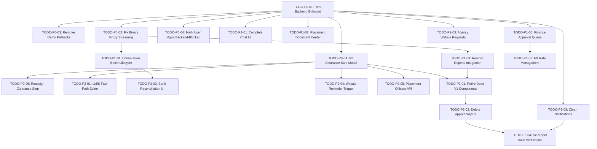

# V2 FRONTEND IMPLEMENTATION & REPAIR TODO PLAN

**Target Branch**: `production_version_non_mock`  
**Backend Authority**: `https://agencytracking-production.up.railway.app`  
**Audit Baseline**: `FINAL_V2_CONFORMANCE_MATRIX.md`  
**Status Policy**: Real Backend Only • No Demo Mode • No Mock Business Data • No V1 Fallbacks  

---

## 1. Priority Architecture & Execution Order

All tasks are strictly prioritized according to system impact:
- **P0 (Blocking Core System)**: Configuration enforcement (real backend only), proxy binary handling, removing silent demo fallbacks, transitioning operational clearance workspaces to V2 Clearance Step model, and retiring broken V1 assignment RPCs.
- **P1 (Required Product Capability)**: Building the dedicated Chat workspace, modernizing placement contract/visa uploads, replacing legacy report views with real backend report APIs, completing commission batch lifecycle UI, and adding finance transaction approvals.
- **P2 (Important Secondary Capability)**: LMIS fast-path editor, bank statement reconciliation, foreign agency wakala requests dashboard, wakala payment reminder trigger, placement officers introspection, and FX rate management.
- **P3 (Non-Critical / Admin Polish)**: Retiring dead V1 components, full deletion of `applicantApi.ts`, cleaning `localStorage` business persistence in notifications, and full build/typecheck verification.

---

## 2. Master Itemized Repair Plan

| ID | Feature | Problem | Current Behavior | Expected V2 Behavior | Exact Backend Endpoint | Priority | Dependencies | Files Likely Affected | Status |
|---|---|---|---|---|---|---|---|---|---|
| **TODO-P0-01** | Production Real Backend Enforcement | `.env.local` has `NEXT_PUBLIC_DEMO_MODE=true` and `isDemoMode()` uses localStorage override, causing UI to read simulated data. | Returns dummy records from `demoStore`. | Strictly query live Railway backend (`NEXT_PUBLIC_DEMO_MODE=false`). Purge runtime demo toggle. | All endpoints | **P0** | None | `.env.local`, `src/lib/config/env.ts`, `src/components/providers/AuthProvider.tsx` | **IMPLEMENTED** |
| **TODO-P0-02** | Proxy Binary Stream Corruptions | Next.js method proxy (`route.ts`) parses `res.json()` on all responses, mangling binary Excel and PDF exports into error strings. | Calling `export_commissions_xlsx` or `get_batch_invoice_pdf` returns JSON error. | Proxy checks `Content-Type` and streams raw binary `Response` with intact headers. Client returns Blob. | `agency_tracking.report_api.export_commissions_xlsx`, `agency_tracking.finance_api.get_batch_invoice_pdf` | **P0** | None | `src/app/api/method/[...slug]/route.ts`, `src/lib/api/v2/client.ts` | **IMPLEMENTED** |
| **TODO-P0-03** | Remove Silent Demo Fallbacks in API Layer | `src/lib/api/v2/*` catches backend failures and silently returns fake demo fixtures instead of surfacing errors. | Operators see mock data when network or permission fails, hiding real backend errors. | Propagate honest `ApiV2Error` with parsed `_server_messages` and HTTP status code. No fake fallback data. | All endpoints | **P0** | None | `src/lib/api/v2/finance.ts`, `documents.ts`, `reports.ts`, `notifications.ts`, `applicants.ts`, `complaints.ts`, `cv.ts` | **READY** |
| **TODO-P0-04** | Operational Clearance Workspace V2 Model | `RoleWorkspaceContainer.tsx` renders 5 separate V1 tabs backed by legacy DocTypes and `applicantApi.ts`. | Workspace runs on obsolete LMS/Injaz/Wakala models. | Single unified V2 Clearance Queue using `OperationalTable` backed by `list_my_clearance_steps`. `OperationalDrawer` executes sanctioned V2 actions. | `agency_tracking.clearance_api.list_my_clearance_steps`, `start_clearance_step`, `complete_clearance_step`, `submit_embassy_step`, `stamp_embassy_step`, `reject_embassy_step`, `reassign_clearance_step` | **P0** | TODO-P0-01, TODO-P0-03 | `src/components/operational/RoleWorkspaceContainer.tsx`, `src/components/operational/OperationalTable.tsx`, `src/components/operational/OperationalDrawer.tsx`, `src/app/applicants/page.tsx` | **READY** |
| **TODO-P0-05** | Clearance Step Reassignment & Officer Identifier Convention | `AssignEmployeeModal.tsx` calls legacy V1 `getSystemUsersApi` and uses obsolete assignment models. | Obsolete modal attempts to set DocType-level employee fields. | Uses sanctioned V2 `reassign_clearance_step` passing User `name` (email) per backend convention. | `agency_tracking.clearance_api.reassign_clearance_step` | **P0** | TODO-P0-04 | `src/components/applicant/AssignEmployeeModal.tsx`, `src/components/applicant/ApplicantTable.tsx`, `src/app/applicants/[id]/page.tsx` | **READY** |
| **TODO-P0-06** | User Management Backend-Blocked Classification | `/employees` page calls `create_system_user` which does not exist in V2 backend. | Page attempts to call dead V1 RPC `applicant_processing.applicant_processing.api.create_system_user`. | UI honest banner explaining user provisioning is managed via Frappe Desk / Backend Admin. Disable broken RPC. | None (Backend-Blocked) | **P0** | None | `src/app/employees/page.tsx` | **READY** |
| **TODO-P1-01** | Full Functional V2 Chat Interface & Route | Backend provides complete `chat_api`, but frontend has NO chat page or interface. | Chat capability exists in backend but is completely inaccessible to users. | Complete Chat workspace at `/chat` with thread list, message stream, agency/internal thread creation, read receipts, attachments, and mentions. Linked in `AppSidebar`. | `agency_tracking.chat_api.list_threads`, `create_agency_thread`, `create_internal_thread`, `get_thread_messages`, `send_message`, `mark_read`, `add_participant` | **P1** | TODO-P0-01 | `src/app/chat/page.tsx`, `src/components/chat/ChatContainer.tsx`, `src/components/layout/AppSidebar.tsx`, `src/lib/api/v2/communication.ts` | **READY** |
| **TODO-P1-02** | Placement Document Center (Contract & Visa Upload) | `contractor-doc/page.tsx` relies on deleted `Applicant Dossier` doctype and `parse_dossier_file`. | Uploading contract invokes obsolete V1 dossier workflow. | Modern Placement Document Center uploading directly to Placement via `upload_contract` (Saudi/Kuwait) and `upload_visa` (Kuwait), using real parsers. | `agency_tracking.placement_api.upload_contract`, `upload_visa`, `contract_parser.parse_contract_file`, `contract_parser.parse_visa_file` | **P1** | TODO-P0-01 | `src/app/applicants/[id]/contractor-doc/page.tsx`, `src/lib/api/v2/placements.ts`, `src/lib/api/v2/documents.ts` | **READY** |
| **TODO-P1-03** | V2 Reports & Management Analytics Integration | `/reports` page embeds legacy V1 report views querying obsolete clearance doctypes. | Analytics show empty or broken legacy clearance tables. | Direct integration of all 10 real V2 report endpoints (`daily_work`, `staff_performance`, `complaint_aging`, `pending_approval_queue`, `cost_breakdown`, `employee_financial`, `placement_aging`, `operations_summary`, `export_commissions_xlsx`). | `agency_tracking.report_api.*` | **P1** | TODO-P0-02 | `src/app/reports/page.tsx`, `src/lib/api/v2/reports.ts` | **READY** |
| **TODO-P1-04** | Commission Batch Lifecycle & Invoice PDF UI | `/commission` page only supports full settlement with fake batch references. | Cannot create batches, download invoice PDFs, upload payment proofs, or settle per-item. | Complete batch management: select unbatched owed commissions ➔ `create_commission_batch` ➔ download `get_batch_invoice_pdf` ➔ upload proof via `upload_batch_payment_proof` ➔ partial settlement via `settle_batch_items`. | `agency_tracking.finance_api.create_commission_batch`, `get_batch_invoice_pdf`, `upload_batch_payment_proof`, `settle_batch_items`, `settle_batch`, `get_owed_commissions` | **P1** | TODO-P0-02 | `src/app/commission/page.tsx`, `src/lib/api/v2/finance.ts` | **READY** |
| **TODO-P1-05** | Financial Transaction Approval & Pending Queue | `/expenses-income` only logs Pending transactions; Finance Managers cannot approve or review queue. | Pending expenses and income remain unapproved with no approval controls. | Approval queue tab powered by `report_api.get_pending_approval_queue` with `approve_transaction`, `reject_transaction`, and `void_transaction` actions. | `agency_tracking.finance_api.approve_transaction`, `reject_transaction`, `void_transaction`, `report_api.get_pending_approval_queue` | **P1** | TODO-P0-01 | `src/app/expenses-income/page.tsx`, `src/lib/api/v2/finance.ts` | **READY** |
| **TODO-P2-01** | LMIS Fast-Path Intake Editor | Saudi LMIS & Kuwait LMIS roles need narrow editing for exam date, COC status, labor ID, national ID, emergency contacts. | Currently no UI exposes the narrow LMIS update endpoint. | Add dedicated LMIS metadata editor drawer in `OperationalDrawer` calling `update_applicant_for_lmis`. | `agency_tracking.applicant_api.update_applicant_for_lmis` | **P2** | TODO-P0-04 | `src/components/operational/OperationalDrawer.tsx`, `src/lib/api/v2/applicants.ts` | **READY** |
| **TODO-P2-02** | Bank Statement Reconciliation UI | Banking CSV upload and manual statement matching endpoints are not exposed in frontend. | No UI for bank statement reconciliation. | Reconciliation sub-tab in `/expenses-income` to upload CSV and manually match unmatched statement lines to commission batches. | `agency_tracking.reconciliation_api.upload_bank_statement`, `manually_match_line` | **P2** | TODO-P1-04 | `src/app/expenses-income/page.tsx`, `src/lib/api/v2/finance.ts` | **READY** |
| **TODO-P2-03** | Foreign Agency Wakala Requests View | Foreign Agency portal has candidate selection and complaints, but no Wakala status view. | Foreign agency cannot see pending Wakala fees on their candidates. | Dedicated Wakala tab in `/agent` calling `list_my_wakala_requests`. | `agency_tracking.portal_api.list_my_wakala_requests` | **P2** | TODO-P0-01 | `src/app/agent/page.tsx`, `src/lib/api/v2/portal.ts` | **READY** |
| **TODO-P2-04** | Manual Wakala Payment Reminder Action | Staff currently cannot manually trigger Wakala reminders from the clearance drawer. | Reminder watchdog runs automatically on backend, but manual trigger is missing from UI. | Add "Send Wakala Reminder" action button in `OperationalDrawer` for Embassy steps. | `agency_tracking.notification_api.trigger_wakala_reminder` | **P2** | TODO-P0-04 | `src/components/operational/OperationalDrawer.tsx`, `src/lib/api/v2/notifications.ts` | **READY** |
| **TODO-P2-05** | Placement Officer Assignment Introspection | UI does not inspect which officer is assigned to which clearance step on a Placement. | No V2 client wrapper for `chat_engine.get_placement_officers`. | Implement `getPlacementOfficersV2` in `clearance.ts` and display in Placement detail view. | `agency_tracking.chat_engine.get_placement_officers` | **P2** | TODO-P0-04 | `src/lib/api/v2/clearance.ts`, `src/app/applicants/[id]/page.tsx` | **READY** |
| **TODO-P2-06** | FX Rate Management Modal | Finance Manager / Admin have no UI to view or manually set FX rates. | Currency conversions rely on server defaults with no frontend visibility or manual overrides. | Simple FX Rate modal in `/expenses-income` allowing Finance Managers to view and set manual rates. | `agency_tracking.finance_api.get_fx_rate`, `set_fx_rate` | **P2** | TODO-P1-05 | `src/app/expenses-income/page.tsx`, `src/lib/api/v2/finance.ts` | **READY** |
| **TODO-P3-01** | Retire Dead Obsolete V1 Components | `ProcessingStreamsModal.tsx`, `ContractRequestModal.tsx`, and legacy report views are dead code. | Clutter codebase and contain legacy V1 RPC references. | Safely delete dead components and clean up unused imports. | None | **P3** | TODO-P0-04, TODO-P1-03 | `src/components/applicant/*`, `src/components/reports/*` | **READY** |
| **TODO-P3-02** | Complete Deletion of `applicantApi.ts` | 115 KB legacy file contains 25 `applicant_processing.*` calls and raw resource queries. | Historical source of architectural drift. | Ensure all 18 consumers are migrated to `@/lib/api/v2/*` and delete `src/lib/api/applicantApi.ts`. | None | **P3** | All P0 & P1 tasks | `src/lib/api/applicantApi.ts` | **READY** |
| **TODO-P3-03** | Clean Notifications `localStorage` Persistence | Dismissed notifications array is stored in browser `localStorage`. | Violates no-localStorage business persistence rule. | Align `/notifications` UI with real push subscription toggle and active backend compliance alerts without localStorage persistence. | `agency_tracking.notification_api.get_push_subscription_status`, `subscribe_to_push` | **P3** | TODO-P0-01 | `src/app/notifications/page.tsx` | **READY** |
| **TODO-P3-04** | Comprehensive TypeScript & Build Verification | Full project build verification after all migrations. | Potential type discrepancies across refactored pages. | Clean execution of `npx tsc --noEmit` and `npm run build` with 0 errors. | All | **P3** | All tasks | Workspace-wide | **READY** |

---

## 3. Execution Dependency Graph

