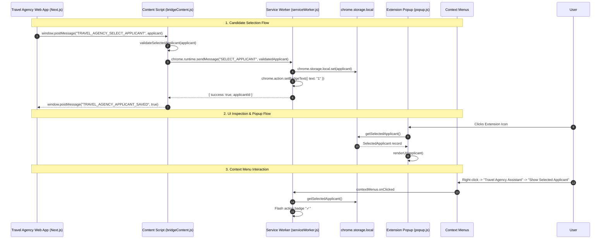

# System Architecture — Travel Agency Browser Extension

This document outlines the architectural boundaries, messaging flow, security guarantees, and execution lifecycle of the **Travel Agency Assistant** extension.

---

## 1. End-to-End System Diagram



---

## 2. Component Descriptions

### A. Next.js Web App Integration Layer (`src/lib/extensionBridge.ts`)
- **Role**: Client-side TypeScript module within the Next.js frontend.
- **Mechanism**: Dispatches custom `window.postMessage` events with the active candidate payload.
- **Key Advantage**: Does not require hardcoding the dynamic Chrome Extension ID in frontend code, facilitating frictionless local development and production deployments.

### B. Content Script Bridge (`src/content/bridgeContent.ts`)
- **Role**: Runs within the DOM context of the Travel Agency web application.
- **Scope**: Matched strictly to `localhost:*`, `127.0.0.1:*`, and production domain patterns.
- **Responsibility**: Listens for window messages, verifies payload structure, converts to `chrome.runtime.sendMessage`, and notifies the web app upon completion.

### C. Background Service Worker (`src/background/serviceWorker.ts`)
- **Role**: Manifest V3 event router and context menu manager.
- **Lifecycle**: Starts on demand for extension messages, context menu clicks, or install events.
- **Responsibilities**:
  - Initializes context menu hierarchy (`Travel Agency Assistant` -> `Show Selected Applicant`, `Clear Selected Applicant`).
  - Manages action icon badges (`"1"` for candidate loaded, `""` for empty).
  - Handles runtime messages (`SELECT_APPLICANT`, `GET_SELECTED_APPLICANT`, `CLEAR_SELECTED_APPLICANT`, `PING`).

### D. Typed Storage Subsystem (`src/lib/storage.ts`)
- **Storage Target**: `chrome.storage.local`.
- **Key Name**: `travel_agency_selected_applicant`.
- **Validation**: Strict schema validation ensures only well-formed candidate records with valid `applicantId` and `fullName` are persisted.
- **Reactivity**: Subscribes to `chrome.storage.onChanged` to ensure instant updates in the popup without manual polling.

### E. Popup Interface (`src/popup/`)
- **Role**: Browser action dropdown window.
- **States**:
  - **Loading State**: Initial reading of storage.
  - **Empty State**: Renders when no candidate is stored with guidance on how to load one.
  - **Active Selected State**: Displays candidate name, ID, passport, destination, job position, place of birth, religion, and loaded timestamp with a `"Clear Memory"` button.

---

## 3. Data Contract (`SelectedApplicant`)

```typescript
export interface SelectedApplicant {
  applicantId: string;        // e.g. "APP-00042" (Required)
  fullName: string;           // e.g. "Fatima Al-Mansoor" (Required)
  firstName?: string;
  middleName?: string;
  lastName?: string;
  passportNumber?: string;    // e.g. "EP1234567"
  passportExpiry?: string;
  passportIssueDate?: string;
  destinationCountry?: string;// e.g. "Saudi Arabia"
  applicantState?: string;    // e.g. "Processing"
  applicantType?: string;     // e.g. "Standard"
  jobApplied?: string;        // e.g. "Housemaid"
  gender?: "Female" | "Male" | string;
  dateOfBirth?: string;
  age?: number | string;
  religion?: string;          // e.g. "Muslim"
  placeOfBirth?: string;      // e.g. "Oromia"
  maritalStatus?: string;     // e.g. "Single"
  phone?: string;
  city?: string;
  country?: string;
  medicalStatus?: string;     // e.g. "FIT"
  photoUrl?: string;
  selectedAt: string;         // ISO 8601 Timestamp
}
```

---

## 4. Security & Permissions Boundary

| Permission | Justification |
| :--- | :--- |
| `contextMenus` | Creates right-click menu items for quick candidate inspection. |
| `storage` | Persists the active candidate profile locally on the user's browser device. |
| `externally_connectable` | Allows authorized Travel Agency domains to connect if direct extension messaging is used. |

> [!CAUTION]
> **Zero Credentials in Extension**: The browser extension never receives or stores administrative API keys, secrets, or Frappe backend sessions. All candidate records are pushed explicitly by authorized users from the authenticated web application.

---

## 5. Phase 2 Architecture (Future Expansion)

The upcoming Phase 2 implementation will build upon this foundation by adding:
1. **Target Site Adapters**: Domain-specific content scripts targeting foreign recruitment and visa portals (e.g. Wafid, Musaned, Injaz).
2. **Autofill Engine**: Deterministic field mapping engine matching `SelectedApplicant` attributes to web form inputs.
3. **Form Completion Confirmation**: Visual badge indicators and audit logs verifying filled fields.
